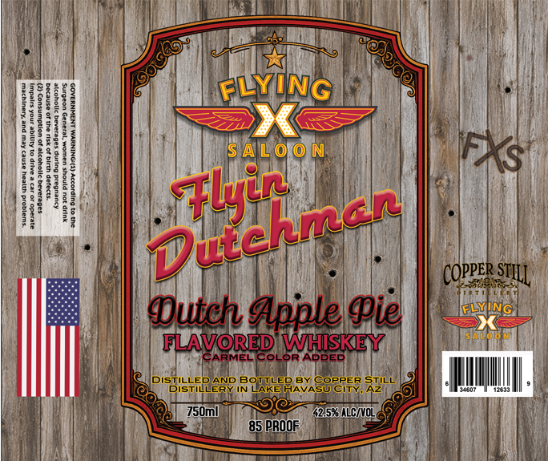

# TTB COLA Label Images - TTBID 26177001000423

**Brand Name:** FLYING X SALOON

**Fanciful Name:** FLYIN DUTCHMAN

**Issue Date:** 07/01/2026

**Origin Code:** 11

**Product Class/Type:** 149

**Source:** [TTB Public COLA Registry](https://ttbonline.gov/colasonline/viewColaDetails.do?action=publicFormDisplay&ttbid=26177001000423)

## Label Images

### Front Label

## Extracted Label Text

*Text extracted via OCR - may contain errors*

**Detected Proof:** 85

### Front Label

I
FLYING

|
H
S AIL 0 0 N
IFXs
U

#'

COPPER =
Dutch dpple Pie
llyinG
sapo8r
FLAVORED WHSKEY
CARMEL COLOR ADDED
PISSISYERENP_
BRAKERRAS8ZER Silt
750m1
G2,.578 WlcIVOL
85 PROOF
1
Dlerral
STILL
