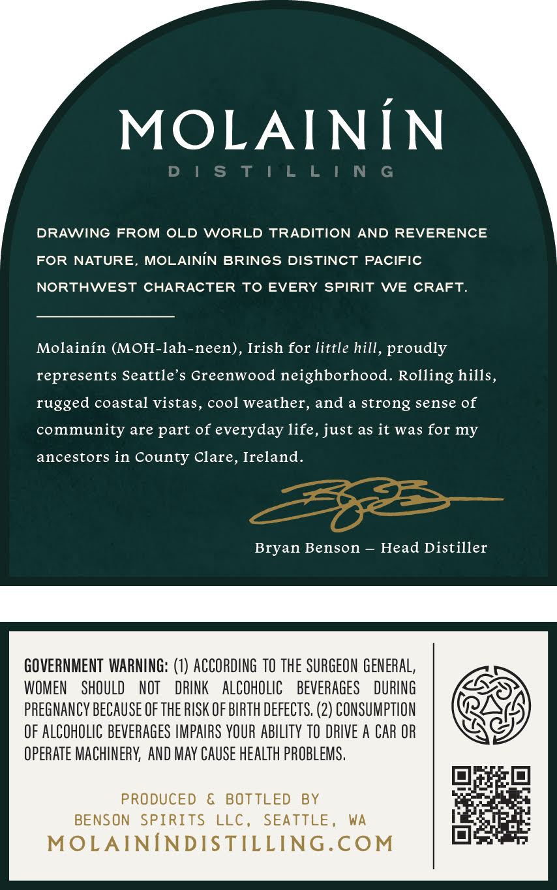
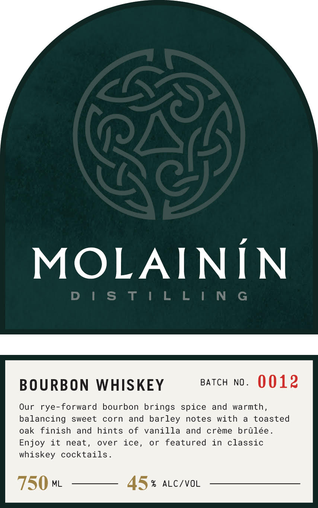

# TTB COLA Label Images - TTBID 26177001000632

**Brand Name:** MOLAININ DISTILLING

**Issue Date:** 07/06/2026

**Origin Code:** 07

**Product Class/Type:** 141

**Source:** [TTB Public COLA Registry](https://ttbonline.gov/colasonline/viewColaDetails.do?action=publicFormDisplay&ttbid=26177001000632)

## Label Images

### Back Label

### Front Label

## Extracted Label Text

*Text extracted via OCR - may contain errors*

**Detected Proof:** 90

### Back Label

f Zz .
DRAWING FROM OLD WORLD TRADITION AND REVERENCE
FOR NATURE, MOLAININ BRINGS DISTINCT PACIFIC
NORTHWEST CHARACTER TO EVERY SPIRIT WE CRAFT.
Molainin (MOH-lah-neen), Irish for little hill, proudly
represents Seattle’s Greenwood neighborhood. Rolling hills,
rugged coastal vistas, cool weather, and a strong sense of
community are part of everyday life, just as it was for my
ancestors in County Clare, Ireland.
Bryan Benson — Head Distiller

GOVERNMENT WARNING: (1) ACCORDING TO THE SURGEON GENERAL,
WOMEN SHOULD NOT DRINK ALCOHOLIC BEVERAGES DURING OES
PREGNANCY BECAUSE OF THE RISK OF BIRTH DEFECTS. (2) CONSUMPTION BAG
OF ALCOHOLIC BEVERAGES IMPAIRS YOUR ABILITY TO DRIVE A CAR OR CAG
OPERATE MACHINERY, AND MAY CAUSE HEALTH PROBLEMS,

PRODUCED & BOTTLED BY er

BENSON SPIRITS LLC, SEATTLE, WA ae rena
MOLAININDISTILLING.COM lee

### Front Label

2
MOLAINiN
D | s T | L L | N G
BOURBON WHISKEY
BATCH
NO _
0012
Our
rye-forward
bourbon brings spice and
warmth ,
balancing sweet
corn
and barley
notes
with
toasted
oak
finish
and
hints
of
vanilla and
creme
brulee _
Enjoy
it
neat
over
or
featured
in
classic
whiskey
cocktails
750 mL
45
%
ALC/VOL
ice ,
