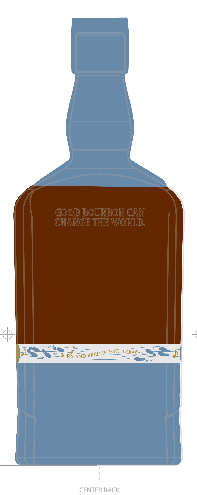
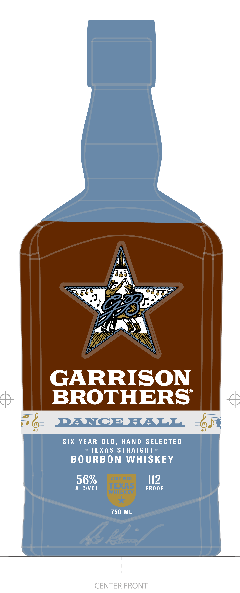
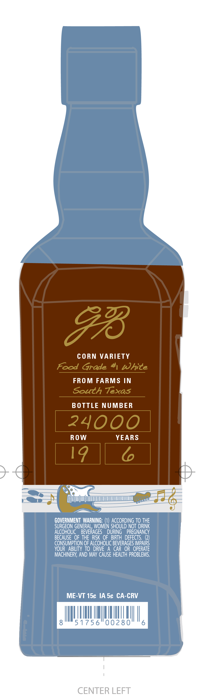
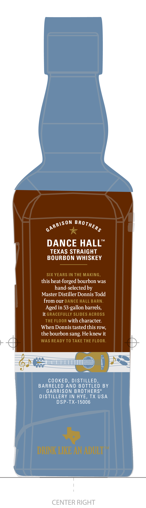

# TTB COLA Label Images - TTBID 26177001000635

**Brand Name:** GARRISON BROTHERS

**Fanciful Name:** DANCE HALL

**Issue Date:** 07/02/2026

**Origin Code:** 44

**Product Class/Type:** 101

**Source:** [TTB Public COLA Registry](https://ttbonline.gov/colasonline/viewColaDetails.do?action=publicFormDisplay&ttbid=26177001000635)

## Label Images

### Back Label

### Front Label

### Label 3

### Label 4

## Extracted Label Text

*Text extracted via OCR - may contain errors*

**Detected Proof:** 112

### Back Label

GOOD BOURBON CAN
CHANGE THE WORLD
INHYE,
AND
CENTER BACK
TEXAS"-
BRED
BORN

### Front Label

GARRISON
BROTHERSS
B6
RANCEHALL
301
SIX- YEAR- OLD ,
HAND- SELECTED
TEXAS STRAIGHT
BO URBON
WHISKEY
56%
CERTIFIED
112
ALCIVOL
TEXAS
PRO OF
WHISKEY
750 ML
Sel
CENTER FRONT

### Label 3

93
CORN VARIETY
Food Grade #White
FRO M FARMS IN
South Texas
BO TTLE NUMBER
24000
Row
YEARS
19
GOVERNMENT WARNING:
ACCORDING TO THE
SURGEON GENERAL, WOMEN SHOULD NOT DRINK
ALCOHOLIC
BEVERAGES
DURING
PREGNANCY
BECAUSE  OF THE RISK  OF   BIRTH  DEFECTS: (2)
CONSUMPTION OF ALCOHOLIC BEVERAGES IMPAIRS
YOUR
ABILITY TO   DRIVE
A CAR
OR
OPERATE
MACHINERY; AND May CAUSE HEALTh PROBLEMS.
ME-VT 15c IA Sc CA-CRV
51756"00280
6
CENTER LEFT

### Label 4

6
TM
DANCE HALL
TEXAS STRAIGHT
BOURBON WHISKEY
SIX YEARS IN THE MAKING _
this heat-forged bourbon was
hand-selected by
Master Distiller Donnis Todd
from our DANCE HALL BARN_
Aged in 53-gallon barrels,
it GRACEFULLY SLIDES AcROSS
THE FLOOR with character
When Donnis tastedthis row;
thebourbon sang: Heknew it
WAS READY TO TAKE THE FLOOR_
COOKED _
DISTILLED_
BARRELED AND BOTTLED BY
GARRISON BROTHERS"
DISTILLERY IN HYE, TX USA
DSP-TX-15006
Fm
DRINK LIKE AN ADULTL
CENTER RIGHT
ARRISON
BROTHER$
