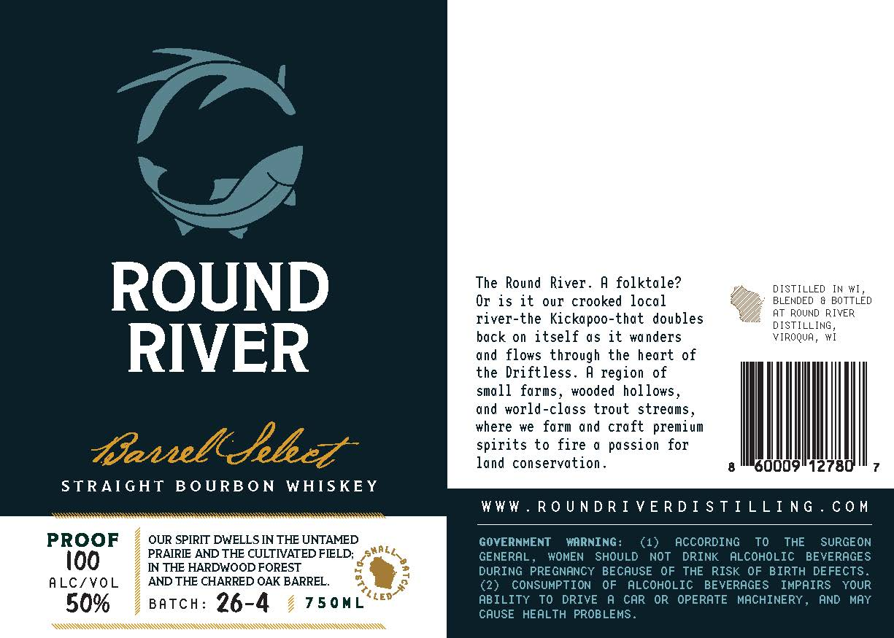

# TTB COLA Label Images - TTBID 26179001000019

**Brand Name:** ROUND RIVER

**Issue Date:** 07/02/2026

**Origin Code:** 48

**Product Class/Type:** 101

**Source:** [TTB Public COLA Registry](https://ttbonline.gov/colasonline/viewColaDetails.do?action=publicFormDisplay&ttbid=26179001000019)

## Label Images

### Label 1

## Extracted Label Text

*Text extracted via OCR - may contain errors*

**Detected Proof:** 100

### Label 1

ROUND
Round River .
A folktale?
DISTILLED
IN WI
Or is it
our crooked local
BLENDED
BOTTLED
AT ROUND
RIYER
river-the Kickapoo-that doubles
DISTILLING
back 0 itself as it wanders
VIROQUA, WI
RIVER
and
flows through the heart of
the Driftless_
A region of
small farms
wooded hollows
and world-class trout streams
where we farm and craft premium
IInelcJebez
spirits to fire
passion for
land conservation
1278
STRAIGHT
B 0 URB 0 N
WHISKEY
WWW
R0 U N D R I VE RD I S T I LLING . Co M
PROOF
OUR SPIRIT DWELLS IN THE UNTAMED
GOVERNMENT
MARNING:
(1)
ACCORDING
To
THE
SURGEON
ioo
PRAIRE AND THE CULTIATED FELD;
GENERAL
WOMEN
SHOULD
NOT
DRINK
ALCOHOLIC
BEVERAGES
NN THE HARDWOOD FOREST
DURING PREGNANCY BECAUSE OF THE RISK OF BIRTH DEFECTS
ALCfVOL
AND THE CHARRED OAK BARREL
(2}
CONSUMPTION
OF
ALCOHOLIC
BEVERAGES
IMPAIRS
YOUR
50%
BATCH:
26-4
750ML
LEd
ABILITY To DRIVE
A CAR OR  OPERATE MACHINERY_
AND MAY
CAUSE HEALTH PROBLEMS .
The
