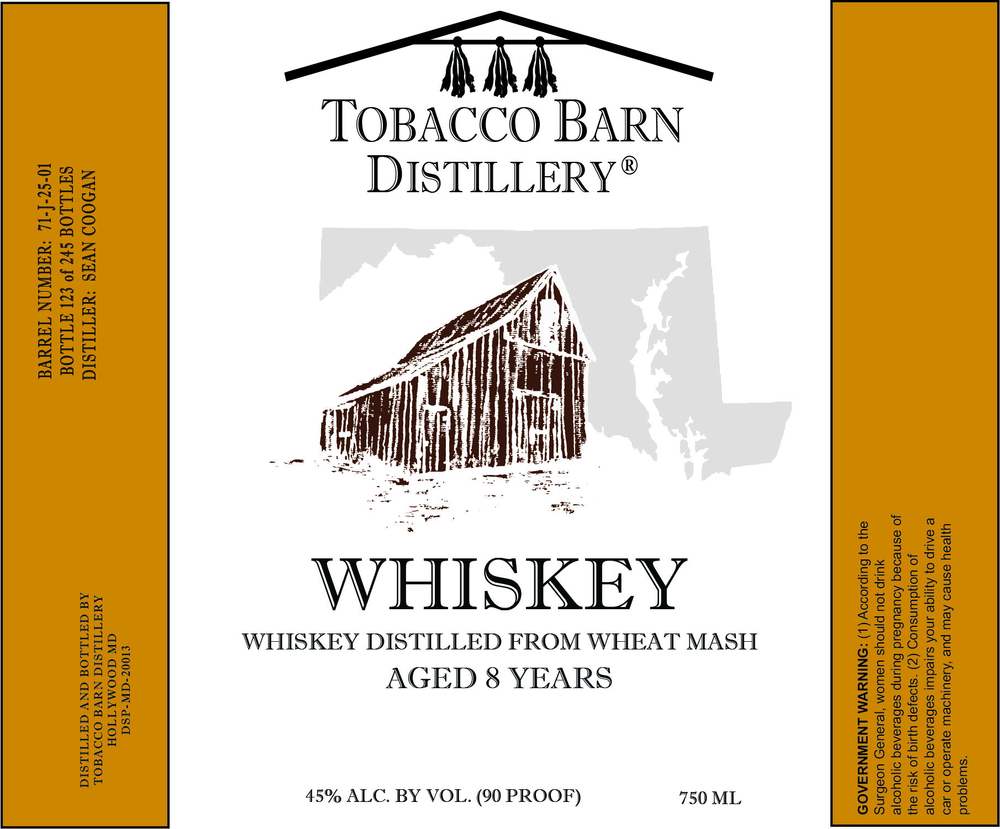

# TTB COLA Label Images - TTBID 26179001000025

**Brand Name:** TOBACCO BARN DISTILLERY

**Issue Date:** 07/09/2026

**Origin Code:** 25

**Product Class/Type:** 140

**Source:** [TTB Public COLA Registry](https://ttbonline.gov/colasonline/viewColaDetails.do?action=publicFormDisplay&ttbid=26179001000025)

## Label Images

### Label 1

## Extracted Label Text

*Text extracted via OCR - may contain errors*

**Detected Proof:** 90
**Detected Age:** 8 Years

### Label 1

“suuajqoid
uyjeay esneo Aew pue ‘Ajouiyoew ajeiado 40 Jeo
2 SAUIP 0} Ajjige INOA suleduu| saBesaneqg ajoyoo|e

JO uoduinsuog (Z) “s}o9Jep yy JO yS11 oy}

jo asneoaq AoueuBbeid Bulinp sabesenaq o1oyooje
YUP JOU Pinoys UBM ‘jei9UaD UOabuNS

8U) 0} Bulpsoooy (|) :ONINYWM LNAINNYSA09

750 ML

WHISKEY
WHISKEY DISTILLED FROM WHEAT MASH
AGED 8 YEARS

MR MA
TOBACCO BARN
DISTILLERY*®

45% ALC. BY VOL. (90 PROOF)

£1007-GW-dSa
GW GOOMATTIOH

NV9009 NVAS ‘WATILSIA ee ee

SUTLLOG S47 Jo £71 ATLLOG
10-S2-[-1L ‘UAaWAN TAWA
