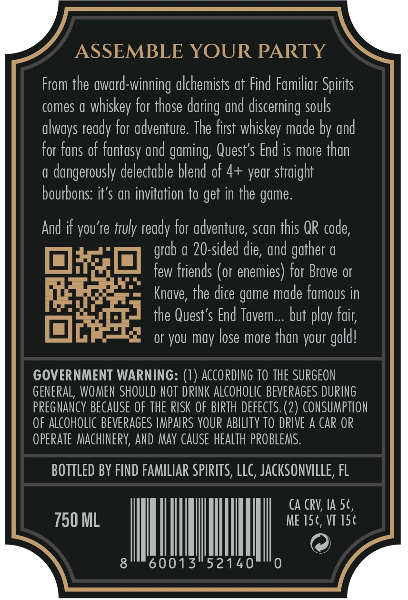
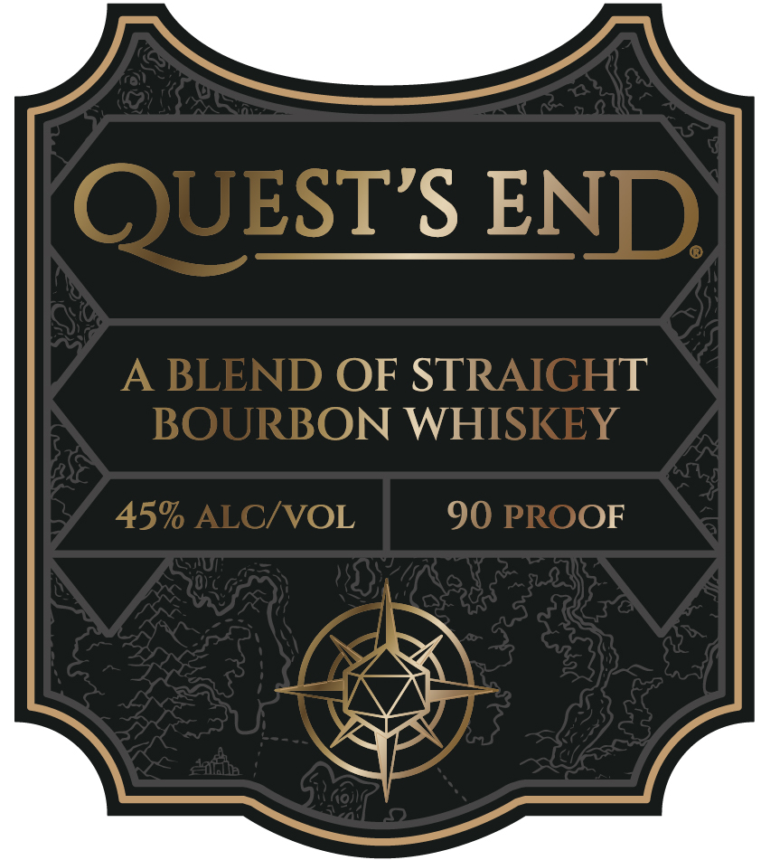
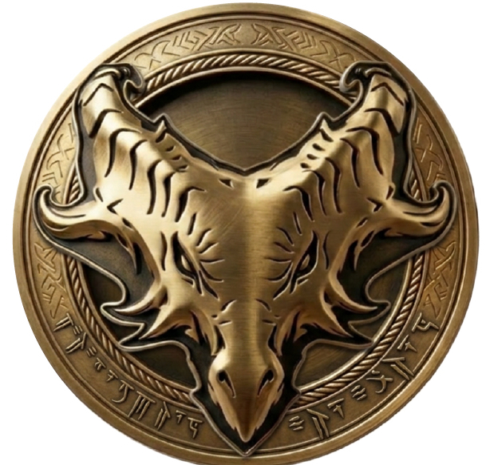
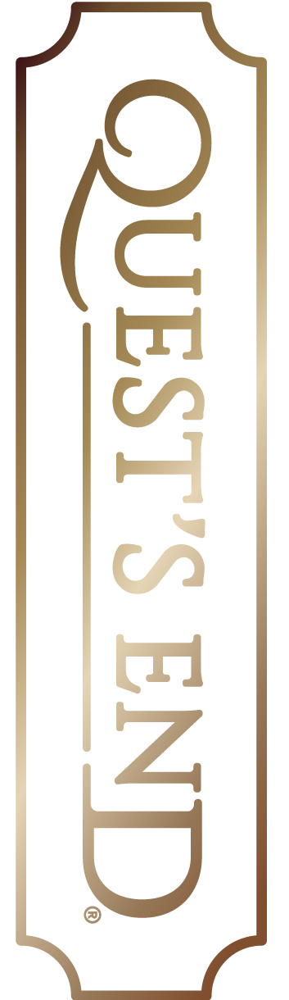
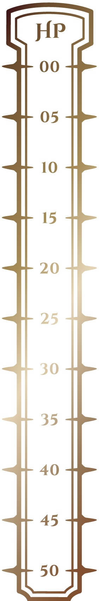

# TTB COLA Label Images - TTBID 26179001000069

**Brand Name:** QUEST'S END

**Issue Date:** 07/02/2026

**Origin Code:** 16

**Product Class/Type:** 121

**Source:** [TTB Public COLA Registry](https://ttbonline.gov/colasonline/viewColaDetails.do?action=publicFormDisplay&ttbid=26179001000069)

## Label Images

### Back Label

### Front Label

### Label 2

### Label 4

### Label 5

## Extracted Label Text

*Text extracted via OCR - may contain errors*

*3 image(s) excluded: text did not meet readability threshold*

**Detected Proof:** 90

### Back Label

ASSEMBLE YOUR PARTY
From the award-winning alchemists at Find Familiar Spirits
comes
whiskey for those
and discerning souls
ready for adventure: The first whiskev made by and
for fans of fantasy and gaming, Quest'$ End is more than
dangerously delectable blend of 4+ year straight
bourbons: it'$ an invitation to get in the game.
And if you're truly ready for adventure, scan this QR code,
20-sided die, and
0
few friends (or enemies) for Brave or
Knave, the dice game made famous in
the Quest's End Tavern _ but play fair;
or you may lose more than your gold!
GOVERNMENT WARNING: (7) ACCORDING TO THE SURGEON
geNERAL, WOMEN SHOULD NOT DRINK ALcoHOLIC beverages DURING
PREGNANCY BECAUSE OF THE RISK OF BIRTH defects: (2) CONSUMPTION
OF ALCOHOLIC BEVERAGES IMPAIPS YOUR ABILITY TO DRIVE A CAR OR
OPERATE MAchinepy, AND May CAUSe HEALTH  PROBLEMS:
BOTTLED BY FIND FAMILIAR SPIRITS, LLC, JAcKSONVILLE , FL
Ca CRV; Ia 5c,
750 ML
ME 15t, VT 154
60013
52140
daring
always
gather
grab

### Front Label

QUESTS END
BLEND OF STRAIGHT
BOURBON WHISKEY
45% ALC/VOL
90 PROOF
