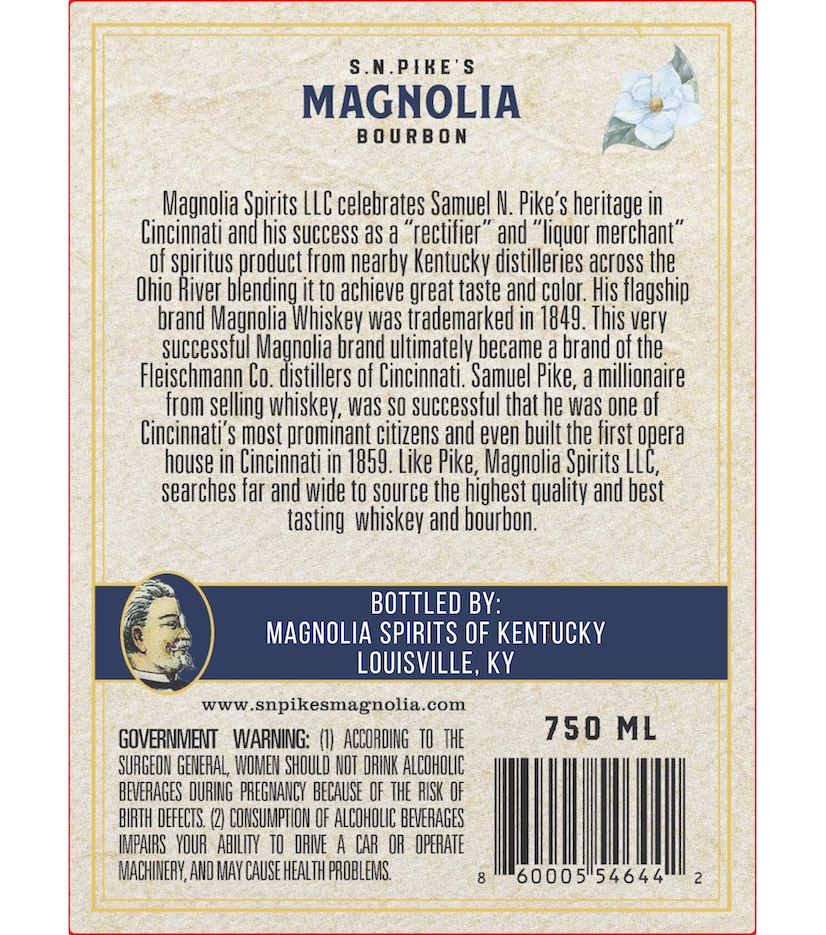
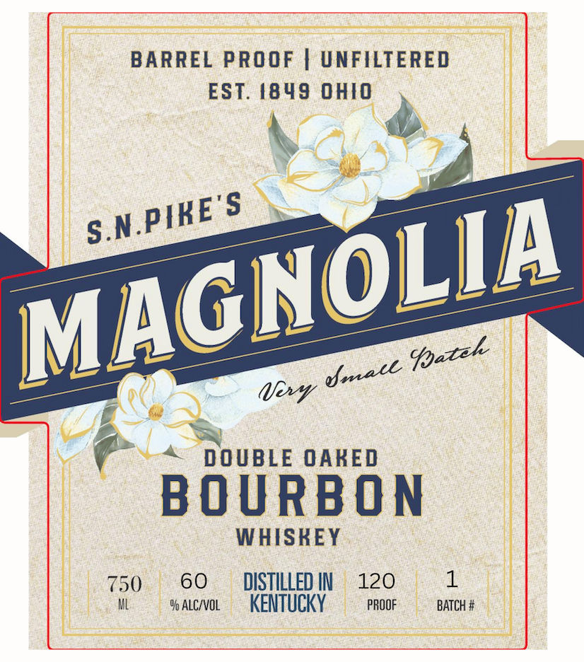
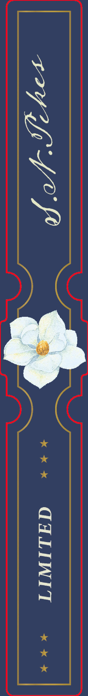

# TTB COLA Label Images - TTBID 26179001000085

**Brand Name:** MAGNOLIA

**Issue Date:** 07/02/2026

**Origin Code:** 22

**Product Class/Type:** 141

**Source:** [TTB Public COLA Registry](https://ttbonline.gov/colasonline/viewColaDetails.do?action=publicFormDisplay&ttbid=26179001000085)

## Label Images

### Back Label

### Label 1

### Label 3

## Extracted Label Text

*Text extracted via OCR - may contain errors*

*1 image(s) excluded: text did not meet readability threshold*

### Back Label

S.N. PIKE'$
MAGNOLIA
B 0 U R B 0 N
Magnolia Spirits LLC celebrates Samuel N. Pike's heritage in
Cincinnati and his SUCCESS aS a "rectifier" and "liquor merchan "
Of spiritus product From nearby Kentucky distilleries across the
Ohio River blending
to
achieve great taste and color: His flagship
brand Magnolia Whiskev waS trademarked in 1849. This verv
SucceSSful Magnolia brand ultimatelv became a brand of the.
Fleischmann Co. distillers Of Cincinnati ' Samuel Pike,a millionaire
from selling whiskey; WaS SQ successful that he was one of
Cincinnati'S most prominant citizens and even built the first opera
house in Cincinnati jn 7859. Like Pike; Magnolia Spirits LLC,
searches far and wide to source the highest quality and best
tasting whiskev and bourbon;
BOTTLED B:
MAGNOLIA SPIRITS OF KENTUCKY
LOUISVILLE, KY
WWW
snpikesmagnolia
com
GOVERNMENT
WARNING:
ACCORDING  T   THE
750 ML
SURGEON GENERAL; WOMEN SHOULD NUT DRINK ALCOHOLC
BEVERAGES DURING PREGHANGY  BECAUSE  OF THE PISK OF
BIRTH DEFECTS: (2} CONSULIPTION OF ALCOHOLIC BEVERAGES
IMPAIRS   YOUR  ABILITY  TO  IRIE
CAR  OR  OPERATE
MACHINEFY AND MAY CAUSE HEALTH PROBLEMS
60005"54644

### Label 1

BARREL PROOF
UNFILTERED
EST. 48 49
OHIO
'S
(it
DOUBLE OAKED
B O U RBO N
WHISKEY
750
60
DISTILLED IN
120
1
% AlcivOL
KENTUCKY
PROOF
BATCH #
S.N.PIKE"
MAGNOLIA
@pazek
Umece
