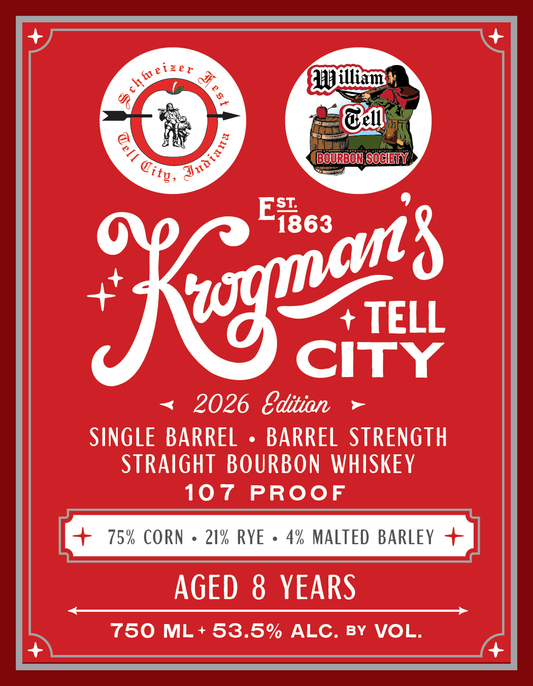
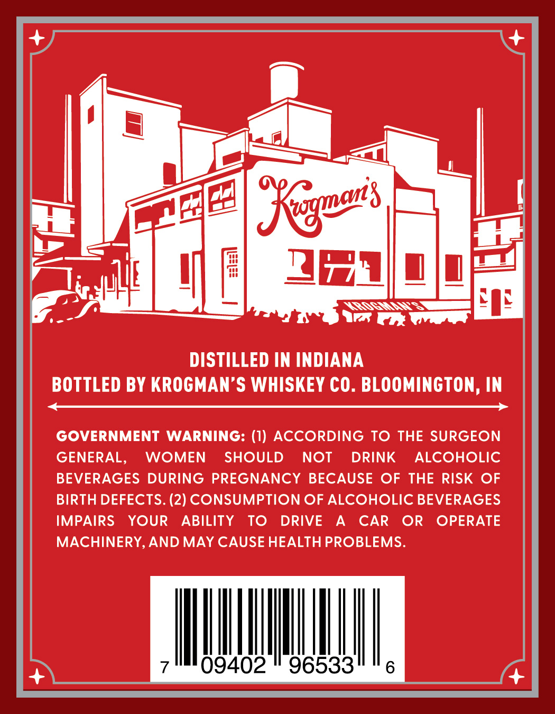

# TTB COLA Label Images - TTBID 26180001000124

**Brand Name:** KROGMAN'S

**Issue Date:** 07/09/2026

**Origin Code:** 19

**Product Class/Type:** 101

**Source:** [TTB Public COLA Registry](https://ttbonline.gov/colasonline/viewColaDetails.do?action=publicFormDisplay&ttbid=26180001000124)

## Label Images

### Label 1

### Label 2

## Extracted Label Text

*Text extracted via OCR - may contain errors*

**Detected Proof:** 107
**Detected Age:** 8 Years

### Label 1

S
Iilliau
@eu
BOUEBoN SOCHY
Ei863
TELL
CITY
2026 Bditian
SINGLE BARREL
BARREL STRENGTH
Straight BOURBON WHISKEY
107
PROoF
75% CORN
21% RYE
4% MALTEd BARLeY
AGED
8 YEARS
750 ML + 53.5% ALC.
BY
VOL.
9h@eie^
4
Jnaiune
9
@itg,
'Kenozs

### Label 2

Kewans
2=
4na
DISTILLED IN INDIANA
BOTTLED BY KROGMAN'$ WHISKEY CO. BLOOMINGTON, IN
GOVERNMENT
WARNING: (1) ACCORDING
TO THE SURGEON
GENERAL,
WOMEN
SHOULD
NOT
DRINK
ALCOHOLIC
BEVERAGES DURING PREGNANCY
BECAUSE OF THE RISK
OF
BIRTH DEFECTS. (2) CONSUMPTION OF ALCOHOLIC BEVERAGES
IMPAIRS
YOUR
ABILITY
To
DRIVE
A
CAR
OR
OPERATE
MACHINERY,AND MAY CAUSE HEALTH PROBLEMS.
09402
96533
6
