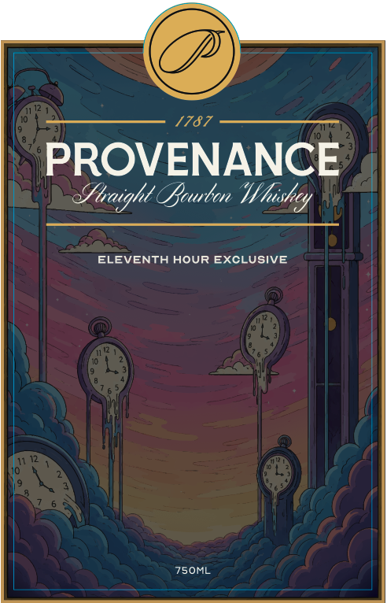
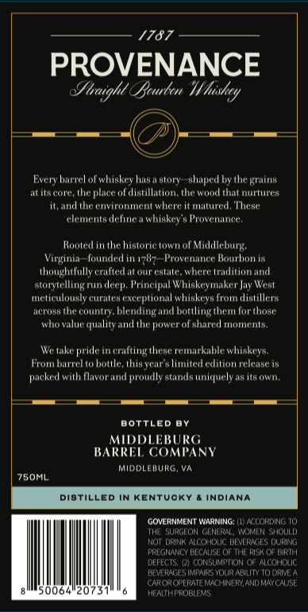
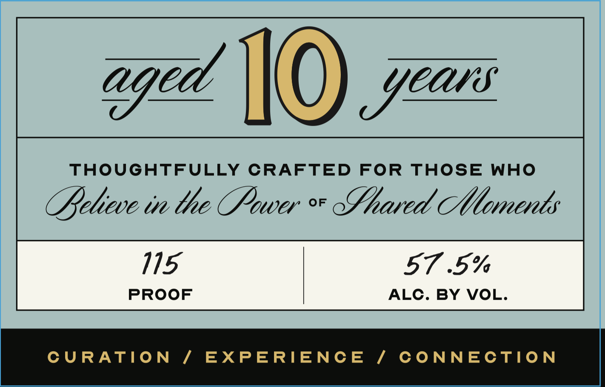

# TTB COLA Label Images - TTBID 26180001000167

**Brand Name:** PROVENANCE ELEVENTH HOUR EXCLUSIVE

**Issue Date:** 07/02/2026

**Origin Code:** 05

**Product Class/Type:** 101

**Source:** [TTB Public COLA Registry](https://ttbonline.gov/colasonline/viewColaDetails.do?action=publicFormDisplay&ttbid=26180001000167)

## Label Images

### Back Label

### Label 1

### Label 3

## Extracted Label Text

*Text extracted via OCR - may contain errors*

### Back Label

1787

PROVENANCE

Siraight Bruton Wi heishey

ELEVENTH HOUR EXCLUSIVE

### Label 1

1787

PROVENANCE

Sanight Barber Whiskey

—— 4) -

Every barrel of whiskey has a story—shaped by the grains

atits core, the place of distillation, the wood that nurtures

it, and the environment where it matured, These
elements define a whiskey's Provenance

Rooted in the historic town of Middleburg,
Virginia—founded in 1787—Provenance Bourbon is
thoughtfully crafted at our estate, where tradition and
storytelling run deep. Principal Whiskeymaker Jay West
‘meticulously curates exceptional whiskeys from distillers
nd bottling them for those

across the country, blendil
lity and the power of shared moments.

We take pride in crafting these remarkable whiskeys,
From barrel to bottle, this year's limited edition release is
packed with flavor and proudly stands uniquely as its own,

BOTTLED BY

MIDDLEBURG
BARREL COMPANY

MIDDLEBURG, VA

7S0ML.

ILLED IN KENTUCKY & INDIANA

[GOVERNMENT WARNING: () A 0

THE SURGEON GENERAL, WOMEN SHOULD
NOT DRINK ALCOHOLIC BEVERAGES DURING
IREGNANCY BECAUSE OF THE RISK OF BIRTH
DEFECTS, (2) CONSUMPTION OF ALCOHOUC
RAGES IMPAIRS YOUR ABILITY TO DRIVE A
"AROR OPERATE RACHINERY, AND MAY CAUSE
alllso064'20731""6 Minn

### Label 3

aged 10) yes
THOUGHTFULLY CRAFTED FOR THOSE WHO
Aeliwe in the Powe * Lhaed Mmenty
115 57 5%
PROOF ALC. BY VOL.
