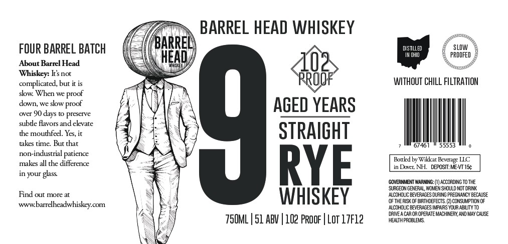

# TTB COLA Label Images - TTBID 26180001000215

**Brand Name:** BARREL HEAD

**Fanciful Name:** 9 YEARS

**Issue Date:** 07/01/2026

**Origin Code:** 33

**Product Class/Type:** 102

**Source:** [TTB Public COLA Registry](https://ttbonline.gov/colasonline/viewColaDetails.do?action=publicFormDisplay&ttbid=26180001000215)

## Label Images

### Label 1

## Extracted Label Text

*Text extracted via OCR - may contain errors*

**Detected Proof:** 102

### Label 1

BARREL HEAD WHISKEY
FOUR BARREL BATCH
BARRE
DIsTLLeD
SLOW
HEAD
OHIo
PROOFED
About Barrel Head
Whiskey: Is not
complicated, but it is
WITHOUT ChILL FILTRATION
slw When we
down; we slow
AGED YEARS
subco fiaoxs aneTekevace
4
the mouthfeel. Yes, it
STRAIGHT
takes time: But that
461
55553
non-industrial patience
Bottkd by Wiktcat Bwagr LLC
makes all the difference
RYE
in Dort;
DEPOSIT: KE-VTIS
in your glass
GOVERNMENT WARMING: (V) ALCoROING TOThE
SURGECN GENERAL WORAEN SHDULd NOT DRINK
Find out more at
WHISKEY
ALCCHOLIC BEVERAGES DURING PREGNANCY BECAUSE
OF THE RISK 0F BIRIHDEFECTS
CONSUMPTIDM OF
Www:
barrelheadwhiskey com
ALCCHOLIC BEVERAGES IMPHIRS YCUR ABILITY T0
DRIVE A CAROR OPERATE MACHINERY, AND MAY CAUSE
75OML | 51 ABV | 102 Proof | Lot 17f12
HEALTHPACQUEVS
proof
proof
