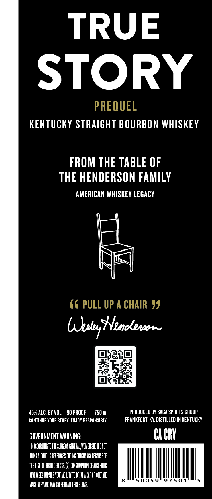
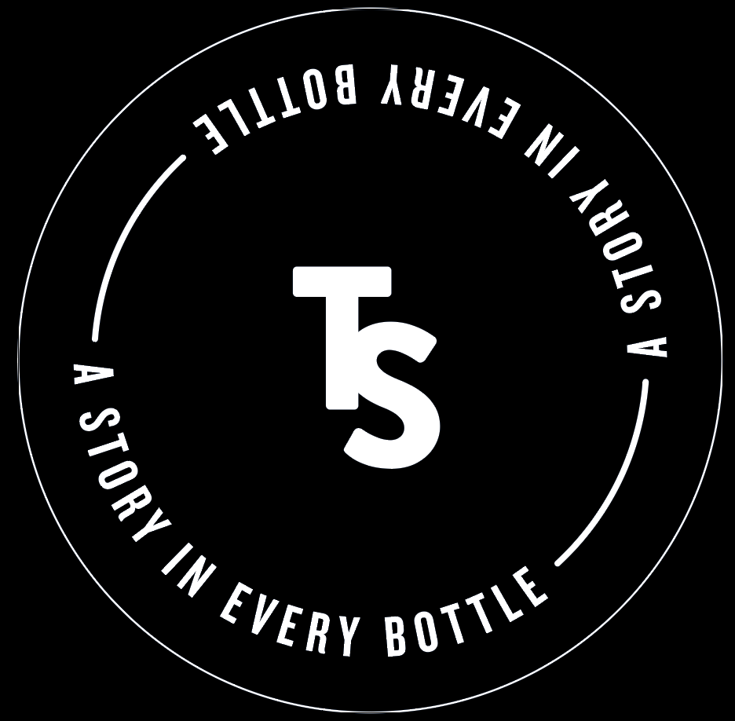

# TTB COLA Label Images - TTBID 26180001000241

**Brand Name:** TRUE STORY

**Fanciful Name:** PREQUEL

**Issue Date:** 07/02/2026

**Origin Code:** 22

**Product Class/Type:** 101

**Source:** [TTB Public COLA Registry](https://ttbonline.gov/colasonline/viewColaDetails.do?action=publicFormDisplay&ttbid=26180001000241)

## Label Images

### Front Label

### Label 1

### Label 3

## Extracted Label Text

*Text extracted via OCR - may contain errors*

*2 image(s) excluded: text did not meet readability threshold*

**Detected Proof:** 90

### Label 1

TRUE
STORY

PREQUEL
KENTUCKY STRAIGHT BOURBON WHISKEY

FROM THE TABLE OF
THE HENDERSON FAMILY

AMERICAN WHISKEY LEGACY

66 PULL UP ACHAIR 99

45% ALC. BY VOL. SOPROOF 750 ml PRODUCED BY SAGA SPIRITS GROUP
CONTINUE YOUR STORY. ENJOY RESPONSIBLY. FRANKFORT, KY. DISTILLED IN KENTUCKY
GOVERNMENT WARNING: CA CRY

(0) AUCOROING TO THE SURGEON GENERAL WOMEN SHOUD ACT
DRINK ALCOHOUC BEVERAGES DURING PREGNANCY BECAUSE OF
THEY OF ITH DEETS (2) CONSUMPTION OF ALCOHOL
BEVERAGES IMPARS YOUR ABLTY TO DRIVE A CAR OR OPERATE
WACHINERY AD MAY CAUSE HEALTH PROBLENS,

8 {li

Il

97501

|
