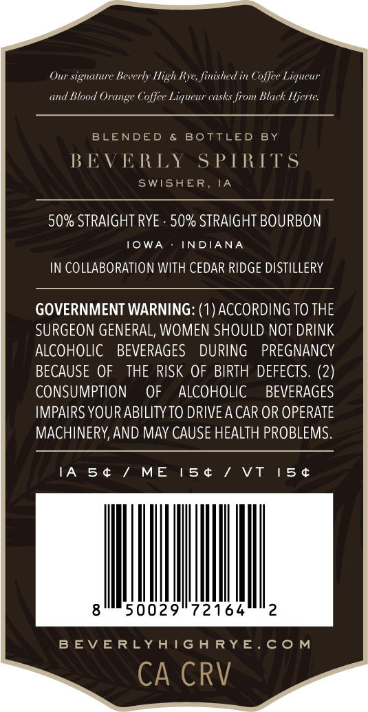
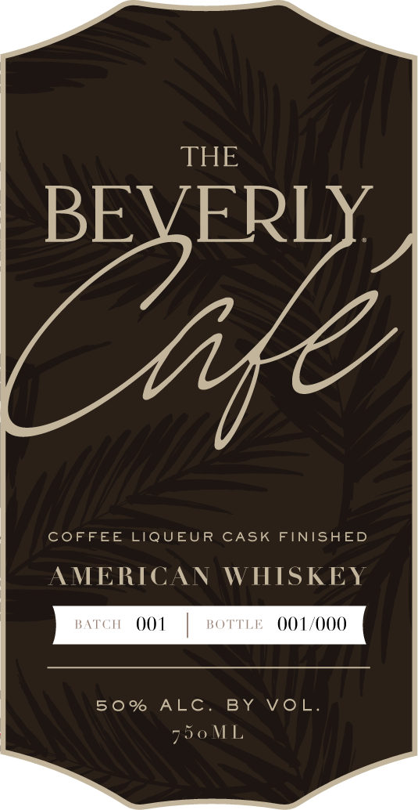
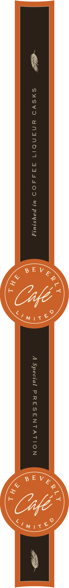

# TTB COLA Label Images - TTBID 26180001000242

**Brand Name:** THE BEVERLY CAFE

**Issue Date:** 07/31/2026

**Origin Code:** 20

**Product Class/Type:** 140

**Source:** [TTB Public COLA Registry](https://ttbonline.gov/colasonline/viewColaDetails.do?action=publicFormDisplay&ttbid=26180001000242)

## Label Images

### Back Label

### Front Label

### Label 3

## Extracted Label Text

*Text extracted via OCR - may contain errors*

**Detected Proof:** 100

### Back Label

Our signature Beverly High Rye finished
Coffee Liquenr
Blood
Coffee Liqueur casks from Black Hjerte
BLENDED
BoTTLED
BY
BEVERLY
S PTRTTS
SWISHER
IA
50% STRAIGHT RYE
50% STRAIGHT BOURBON
0WA
INDIANA
IN COLLABORATION WITH CEDAR RIDGE DISTILLERY
GOVERNMENT WARNING: (1) ACCORDING TO THE
SURGEON GENERAL; WOMEN SHOULD NOT DRINK
ALCOHOLIC
BEVERAGES
DURING
PREGNANCY
BECAUSE OF
THE RISK OF BIRTH DEFECTS: (2)
CONSUMPTION
OF
ALCOHOLIC
BEVERAGES
IMPAIRS YOUR ABILITY TO DRIVEA CAR OR OPERATE
MACHINERY,AND MAY CAUSE HEALTH PROBLEMS_
IA
5 4
ME
15 4
Vt
15 4
50029"72164
2
B EV E RLYATG A RYE
C0 M
CA CRV
Orange
and

### Front Label

THE
BEVERLY
COFFEE LIQUEUR
CASK
FINISHED
MERICAN
WHISKEY
BATCH
001
BOTTLE
001/000
50 %
ALC_
BY
VoL
750 ML

### Label 3

SYSVD YNANOIN 334AAOD UM! paysiury A Special PRESENTATION
