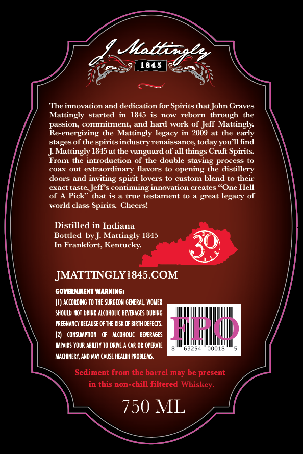
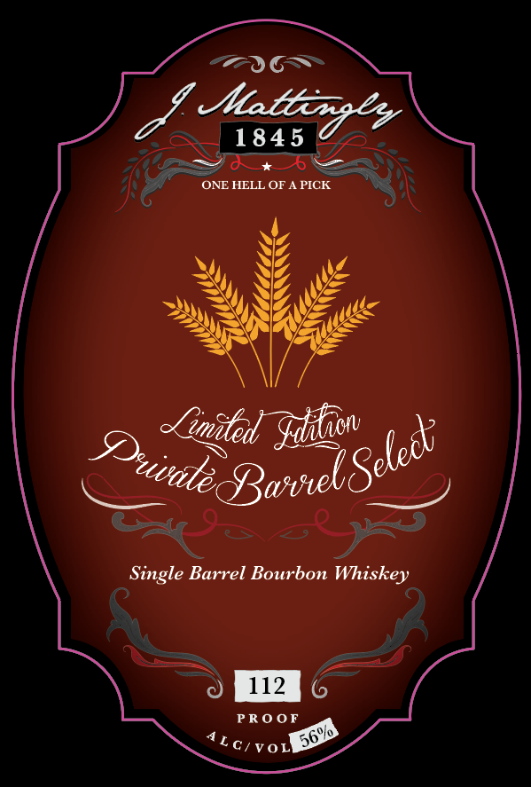

# TTB COLA Label Images - TTBID 26180001000283

**Brand Name:** J. MATTINGLY 1845

**Fanciful Name:** PRIVATE BARREL

**Issue Date:** 07/01/2026

**Origin Code:** 22

**Product Class/Type:** 141

**Source:** [TTB Public COLA Registry](https://ttbonline.gov/colasonline/viewColaDetails.do?action=publicFormDisplay&ttbid=26180001000283)

## Label Images

### Back Label

### Front Label

## Extracted Label Text

*Text extracted via OCR - may contain errors*

### Back Label

Sstba 2
1845
2
The innovation and dedication for Spirits that John Graves
Mattingly
started
1845
now
reborn
through
the
passiOn; commitment; and hard work of Jelf Mattingly
Re-energizing the Mattingly legacy
in  2009
at the early
stagesof the spirits industry renaissance, today you I find
J Mattingly 1815at the vanguard of all things Craft Spirits
FrOm the introduction of the double staving process to
cax Oul
extraordinary flavors
opening the distillery
doors and
inviting spirit lovers to custom blend to their
eract lasle
continuing innovation creates "One Hell
of A Pick" that is
true testament t0
world class Spirits: Cheers=
Distilled in Indiana
Bottled by J Mattingly 1845
In Frankfort, Kentucky:
JMATTINGLY1845.COM
GOVERNMENT WARHING:
{I) according TO ThE SURGEON GEMERAL; WOMEM
shoulD MOt  DRIMK AlcoHOLIC bevERAGES durIng
PREGMANCY BECAUSe dF THE RISK OF BIRTH DEFECTS
CONSUMPTION   Of
AlcohOLIC
BEVERAGES
khhad
IMPAIRS YouR ABILITY TO DIVE _
car OR OPERATE
03254
QooL8
MAchINeRY; AND MAY CAUSE HEALTH PROBLEMS.
Sediment from the barrel may be present
in this non-chill filtered Whiskey-
750 ML
Jefr s
legacy
great _

### Front Label

taticaey
1845
ONE HELL OF
PICK
Jimnled
Single Barrel Bourbon Whiskey
112
PRO0F
VOL
Sdiaonv
Q3wrelSeled;
Duvalec
56%0
Lc/
