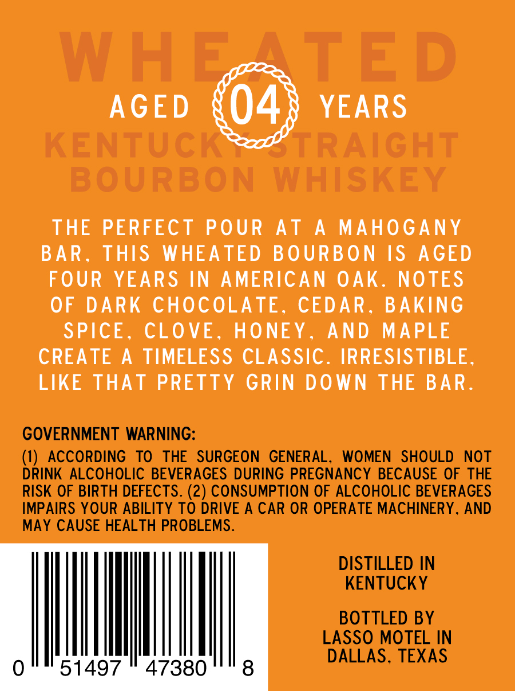
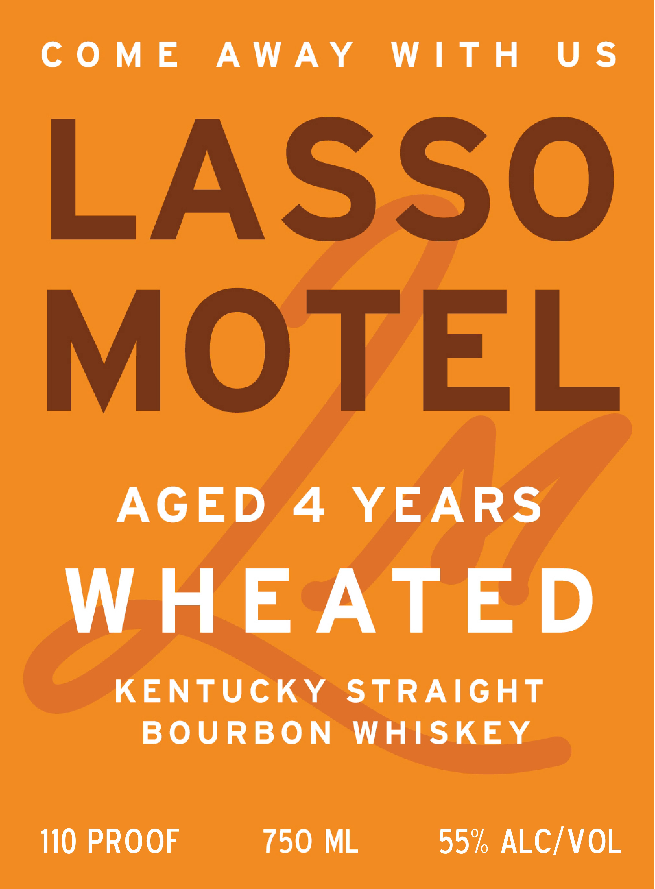

# TTB COLA Label Images - TTBID 26180001000689

**Brand Name:** LASSO MOTEL

**Fanciful Name:** WHEATED

**Issue Date:** 07/01/2026

**Origin Code:** 22

**Product Class/Type:** 101

**Source:** [TTB Public COLA Registry](https://ttbonline.gov/colasonline/viewColaDetails.do?action=publicFormDisplay&ttbid=26180001000689)

## Label Images

### Back Label

### Front Label

## Extracted Label Text

*Text extracted via OCR - may contain errors*

**Detected Proof:** 110
**Detected Age:** 4 Years

### Back Label

W H E
TED
AGED
04
YEARS
KENTUCKRZOTRAIGHT
BOURBON
WHISKEY
THE
PERFECT
POUR
AT
A
MAHOGANY
BAR_
THIS
WHEATED
BOURBON
IS
AGED
FOUR
YEARS IN
AMERICAN
OAK.
NOTES
OF
DARK
CHOCOLATE_
CEDAR _
BAKING
SPICE .
CLOVE
HONEY
AND
MAPLE
CREATE
A
TIMELESS CLASSIC.
IRRESISTIBLE
LIKE
ThaT PRETTY
GRIN
DOWN
THE BAR
GOVERNMENT WARNING:
(1)
ACCORDING
TO
THE
SURGEON
GENERAL.
WOMEN
SHOULD
NOT
DRINK ALCOHOLIC BEVERAGES DURING PREGNANCY BECAUSE OF THE
RISK OF BIRTH DEFECTS. (2) CONSUMPTION OF ALCOHOLIC BEVERAGES
IMPAIRS YOUR ABILITY TO DRIVE A CAR OR OPERATE MACHINERY. AND
MAY CAUSE HEALTH PROBLEMS.
DISTILLED IN
KENTUCKY
BOTTLED BY
LASSO MOTEL IN
DALLAS. TEXAS
51497
47380
8

### Front Label

COME AWAY WITH US

LASSO

MOTEL

AGED 4 YEARS

WHEATED

KENTUCKY STRAIGHT

BOURBON WHISKEY

110 PROOF

750 ML

55% ALC/VOL
