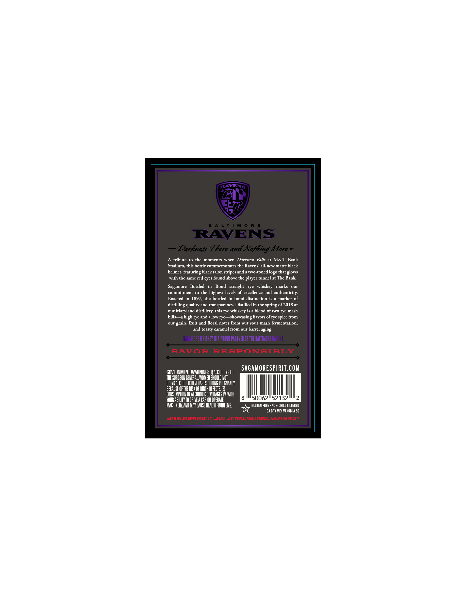
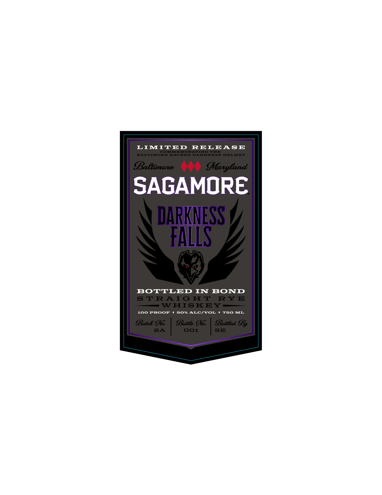

# TTB COLA Label Images - TTBID 26180001000719

**Brand Name:** SAGAMORE

**Fanciful Name:** BOTTLED IN BOND

**Issue Date:** 07/06/2026

**Origin Code:** 25

**Product Class/Type:** 112

**Source:** [TTB Public COLA Registry](https://ttbonline.gov/colasonline/viewColaDetails.do?action=publicFormDisplay&ttbid=26180001000719)

## Label Images

### Back Label

### Front Label

## Extracted Label Text

*Text extracted via OCR - may contain errors*

**Detected Proof:** 100

### Back Label

RAVENS
(B
AL T !
R E
RAVENS
Darknen Tbere and Nofhing More
tribute
to the
moments when  Darkness  Falls
M&T Bank
Stadium, this bottle commemorates the Ravens' all-new matte black
helmet, featuring black talon stripes and
two-toned
that glows
with the same red eyes found above the player tunnel at The Bank
Sagamore
Bottled
Bond   straight
rye
whiskey
marks
out
commitment
the highest levels of excellence and authenticity:
Enacted in 1897, the bottled in bond distinction is
marker of
distilling quality and transparency: Distilled in the spring of 2018 at
our
Maryland distillery this rye whiskey is a blend of two rye mash
bills
high rye and a
rye
~showcasing favors ofrye spice from
our
fruit
foral notes from our sour mash fermentation,
and toasty caramel from our barrel aging:
SAGUMORE WZHIBIEY 1B
PROUD PARTHER OF THE BALTIMORE RAVEHS
SAVOR
RESPONSIBLY
SAGAMORESPIRIT.COM
GOVERNMENT WARMING:
ACCORDIHG TO
THE SURGEON GENERAL, WOMEH SHOULD HOT
DRIHKALCOHOLIC BEVERAGES DURING PREGHAHCY
BECAUSE OF THE RISK OF BIRTH DEFECTS
COHSUMPTIOH F ALCOHOLIC BEVERAGES IMPAIRS
VOUR ABILITY TO DRIVEA CAR OR OPERATE
50062"52132
MACHINERV AHD MAV CAUSE HEALTh PROBLEMS
GLUTEN FREE * NON-CHILL FILTERED
CA CRV ME]-VT ISC IA 5C
AGED IN MET ChARRED OaX BARRELS ; DISTILLED & Bottled By SAGANORE WHISYEY, BALTLMRORE, MARVLAND: dsp-Rd-20019
[logo
low
grain,
and

### Front Label

LIMITED
RELEASE
COMMEMORATING
TIIE
BALTIMORE
RAVENS
DARKNESS
HIELMET
Baetimote
Maryland
SAGAMORE
DARKNESS
FALLS
BOTTLED
IIT
BOND
STRAIGHT
RY E
WHISKEY
100
PROOF
50% ALCIVOL
750
IL
Batce Ic
Bettee Ic:
Betteed SBy
8A
001
SE
