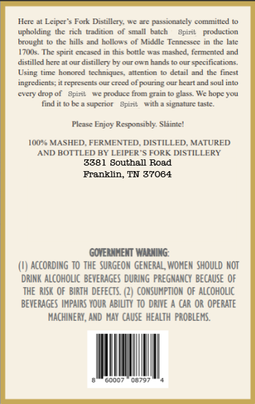
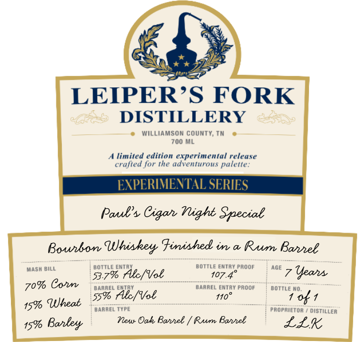

# TTB COLA Label Images - TTBID 26180001000828

**Brand Name:** LEIPER'S FORK DISTILLERY

**Fanciful Name:** PAUL'S CIGAR NIGHT SPECIAL

**Issue Date:** 07/24/2026

**Origin Code:** 43

**Product Class/Type:** 131

**Source:** [TTB Public COLA Registry](https://ttbonline.gov/colasonline/viewColaDetails.do?action=publicFormDisplay&ttbid=26180001000828)

## Label Images

### Back Label

### Label 1

## Extracted Label Text

*Text extracted via OCR - may contain errors*

**Detected Proof:** 110

### Back Label

Hcte
Lciper > Fork Dislillery- We are passionitely commiltcd
upholding the rich  tradition
small   balch
Bpirit
production
brought
the hills and hollow < of Middle Tennesscc
I7(s. The spint encased in this bottle was mashed, femented and
distilled hcre at our distilleny by our oun hands
specifications;
Using tinc
hororcd tcchniqucs_ attention
dctail and thc finest
ingredicnts:
represcnts our creed of pouring our hcart und soul into
cven
drop of
Bpirit
produce [rom
elass We hope You
find
~upenOr
Bpirib
with
signature (asle.
Please Enjoy Rexponsibly Slainte"
1(U%e MASHED FERMENTED DISTILLED MATURED
AND BOTTLED BY LEIPER
FORK DISTILLERY
3381 Southall Road
Franklin
TN 37064
GOVERNHENT WARHING:
according to ThE SuRGEON GENERAL, WOHEN should NOT
DRINK Alcoholc BEvERAGES DURING  PREGNANCY  BEcause OF
THE RISK OF  BIRTH  DEFECTS  (2) CONSUMPTION  oF alcoholic
beVERAGES IMPAIRS YOUR ABILTY To DRIVE
CAR OR OPERATE
MACHINERY, AND  NaY  cause   health  PROBLEMS:
Gooo7
0579i
Jale
FTain

### Label 1

LEIPERS FORK
DISTILLERY
Williamson county; Tn
700 ML
limited edition experimental release
crafted for the adventurous palette:
EXPERIMEVTAL SERIES
Pauls Cigah Mlight Special
Bowbon
Uhinkey Fininhed in
Rum Bannel
MASH BILL
BOTTLE
BoTTLe EnTAY
AOOF
AGE
53.79 At/Vol
107_
{eans
7o% Cohnv
BARREL
BarREL EntAY PrOOF
BOTTLE MO
Al/Vol
110
ok1
15% Uheat
BARREL TYPE
propriETOR
distiller
15%
Boley
Mlew Oak Bannel
Rum Bael
Lik
55%
