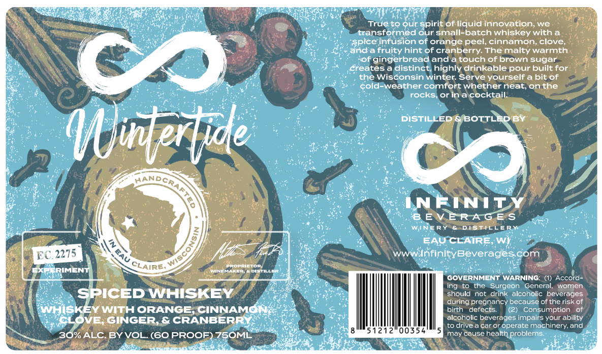

# TTB COLA Label Images - TTBID 26180001001003

**Brand Name:** WINTERTIDE

**Fanciful Name:** SPICED WHISKEY

**Issue Date:** 07/14/2026

**Origin Code:** 48

**Product Class/Type:** 149

**Source:** [TTB Public COLA Registry](https://ttbonline.gov/colasonline/viewColaDetails.do?action=publicFormDisplay&ttbid=26180001001003)

## Label Images

### Front Label

## Extracted Label Text

*Text extracted via OCR - may contain errors*

**Detected Proof:** 60

### Front Label

7065
True to our spirit of liquid innovation; we
transformed our small-batch whiskey with a
infusion of orange peel, cinnamon; clove
anda fruity hint of cranberry: The malty warmth
Vo
of gingerbread and atouch of brown sugar
createsa distinct; highly drinkable pour built for
the Wisconsin winter: Serve yourself a bit of
cold-weather comfort whether neat, on the
rocks
Or
ina cocktail:
DISTILLED & BOTTLEDBY
Qiterlyde
O
4D
INFINITY
BEVERAGE S
WINERY &DiStICCERY
BAU CLAIRE; Wi;
EC 2275
wwWInfinltyBeveragescom
CLAIRE,
proprvetor
KR-RIMENT
CHAKLA
DiSTILLL
GOVERNMENT WARNING:
Accord
ing
the
Surgeon
General;
women
SPICED WHISKEY
should
not
drink alcoholic beverages
during pregnancy because of the risk of
Whiskey
WITH ORANGE
CINNAMON
birth
defects:
consumption
CLOVE; GINGER & CRANBERRY
alcoholic beverages impairs your ability
to drive
car or operate machinery and
30%ALC BYVOL. (GO PROOF) Z75OML
51212"00354
may cause
health problems
pice
8
AU
