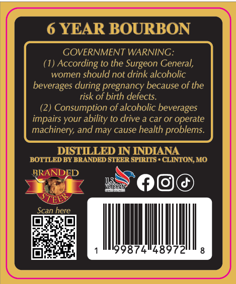
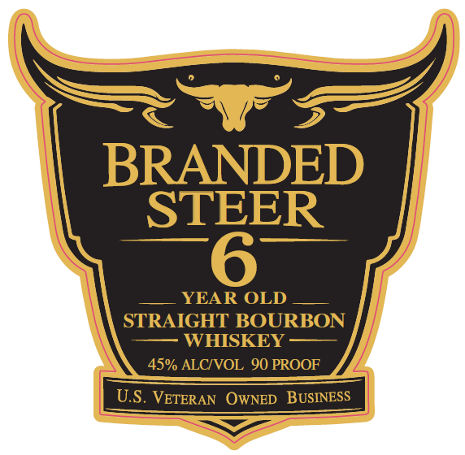

# TTB COLA Label Images - TTBID 26180001001032

**Brand Name:** BRANDED STEER

**Issue Date:** 07/02/2026

**Origin Code:** 29

**Product Class/Type:** 101

**Source:** [TTB Public COLA Registry](https://ttbonline.gov/colasonline/viewColaDetails.do?action=publicFormDisplay&ttbid=26180001001032)

## Label Images

### Back Label

### Front Label

## Extracted Label Text

*Text extracted via OCR - may contain errors*

**Detected Proof:** 90
**Detected Age:** 6 Years

### Back Label

6 YEAR BOURBON
GOVERNMENT WARNING:
(1) According to the Surgeon General,
women should not drink alcoholic
beverages during pregnancy because of the
risk of birth defects.
(2) Consumption of alcoholic beverages
impairs your ability to drive a car or operate
machinery; and may cause health problems
DISTLLED IN INDIANA
BOTTLED BY BRANDED STEER SPIRITS . CLINTON,MO
BRANDED
KXFTERSI:
Scan here
4897

### Front Label

BRANDED
STEER
YEAR OLD
STRAIGHT BOURBON
WHISKEY
45% ALCIVOL 90 PROOF
U.S. VETERAN   OWNED   BUSINESS
