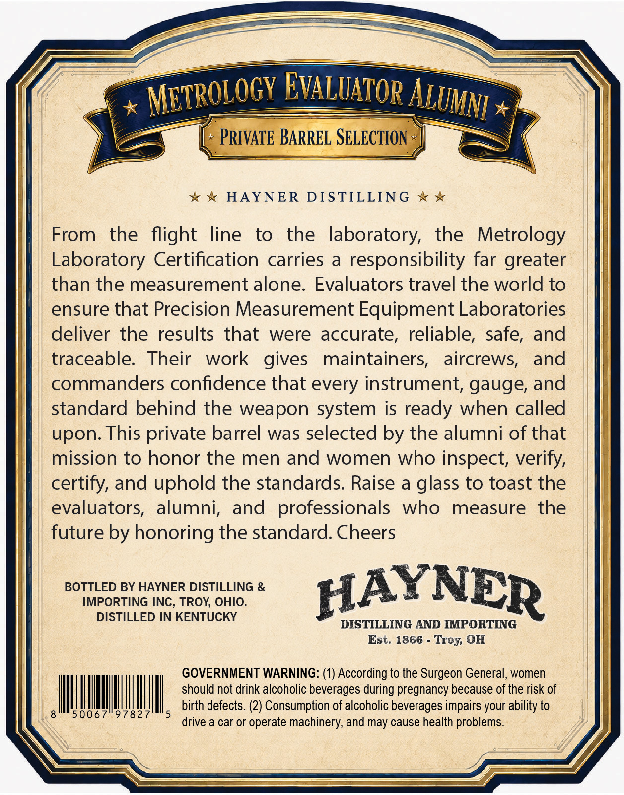
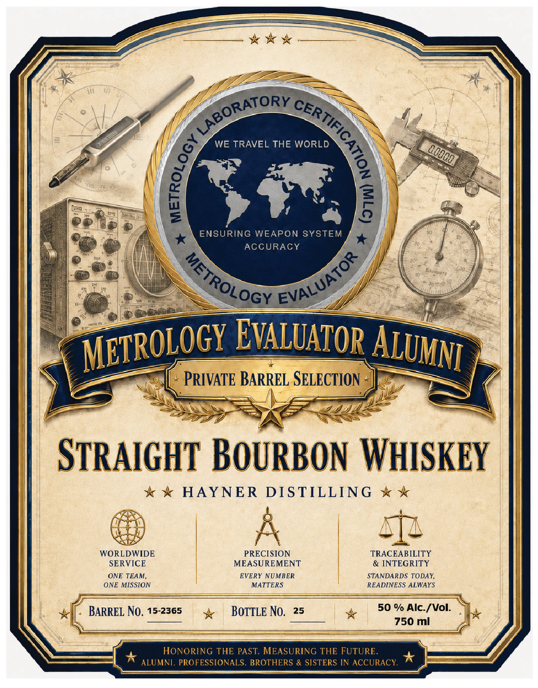

# TTB COLA Label Images - TTBID 26180001001034

**Brand Name:** HAYNER DISTILLING

**Fanciful Name:** HAYNER METROLOGY EVALUATOR ALUMNI PRIVATE BARREL

**Issue Date:** 07/06/2026

**Origin Code:** 09

**Product Class/Type:** 101

**Source:** [TTB Public COLA Registry](https://ttbonline.gov/colasonline/viewColaDetails.do?action=publicFormDisplay&ttbid=26180001001034)

## Label Images

### Back Label

### Front Label

## Extracted Label Text

*Text extracted via OCR - may contain errors*

**Detected Proof:** 100

### Back Label

Metrologv EvALUAtor
PRIVATE BARREL SELECTION
HAYNER
DISTILLING
From
the
flight
line
to
the  laboratory,
the
Metrology
Laboratory Certification carries
a
responsibility far greater
than the measurement alone: Evaluators travel the world to
ensure that Precision Measurement Equipment Laboratories
deliver the results that
were accurate, reliable,
safe, and
traceable
Their
work
gives
maintainers,
aircrews,
and
commanders confidence that every instrument; gauge; and
standard behind the weapon system is ready when called
upon. This private barrel was selected by the alumni of that
mission to honor the men and women who inspect; verify,
certify, and uphold the standards Raise a glass to toast the
evaluators,
alumni;
and  professionals
who
measure
the
future by honoring the standard. Cheers
BOTTLED BY HAYNER DISTILLING &
HAYNER
IMPORTING INC, TROY, OHIO.
DISTILLED IN KENTUCKY
DISTILLING AND IMPORTING
Est. 1866 - Troy OH
GOVERNMENT WARNING: (1) According to the Surgeon General, women
should not drink alcoholic beverages during pregnancy because of the risk of
birth defects. (2) Consumption of alcoholic beverages impairs your ability to
50067"97827
drive a car or operate machinery, and may cause health problems
ALuMni

### Front Label

WE TRAVEL THE WORLD
Lq
5
ENSURING
WEAPON SYSTEM
ACCURACY
EvAluATor
PRIVATE BARREL SELECTION
STRAIGHT BOURBON WHISKEY
HAYNER
DIS TILLING
WORLDWIDE
PRECISION
TRACEABILITY
SERVICE
MEASUREMENT
& INTEGRITY
ONE TEAM;
EVERY NUMBER
STANDARDS TODAY,
ONE MISSION
MATTERS
READINESS ALWAYS
BARREL No. 15-2365
BOTTLE No.
25
50 % Alc-/Vol_
750 ml
HONORING THE PAST. MEASURING THE FUTURE.
ALUMNI. PROFESSIONALS . BROTHERS & SISTERS IN ACCURACY:
LABORATORY
)
(
upo0e8}
EVALUATOR
METROLOGY
bieonens
Metrology
ALuMni
