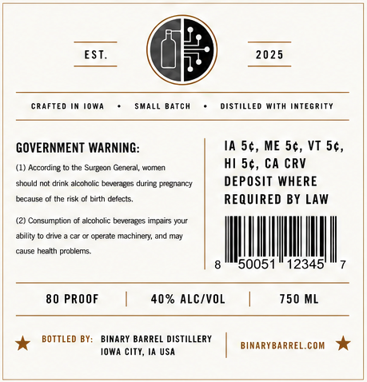
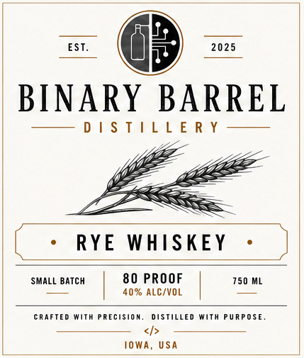

# TTB COLA Label Images - TTBID 26180001001035

**Brand Name:** BINARY BARREL

**Issue Date:** 07/06/2026

**Origin Code:** 20

**Product Class/Type:** 142

**Source:** [TTB Public COLA Registry](https://ttbonline.gov/colasonline/viewColaDetails.do?action=publicFormDisplay&ttbid=26180001001035)

## Label Images

### Back Label

### Front Label

## Extracted Label Text

*Text extracted via OCR - may contain errors*

**Detected Proof:** 80

### Back Label

EST_
2025
CRAFTED
Iowa
SMALL Batch
DISTILLEd With InTEGRiTY
GOVERNMENT WARNING:
IA 5c, ME 5c, VT 5c,
(1) According
the Surgean General
women
Hi 5c, CA CRV
should not drink alcotxlic beveraBes during pregnancy
DEPOSIT WHERE
cacause
the risk
birth defects;
REQUIRED BY LAW
Consuimctian
alcoholic beverages impairs your
ability
One
Ccerate machinen, and Mal
cause health problems
50051
12345"
80 PROOF
40% ALCVOL
750 ML
BOTTLED BY:
BINARY BARREL DISTILLERY
BIMARYBARREL.COM
iowa city, Ia USA

### Front Label

EST.
2025
BINARY BARREL
D | $ T | L [ E R Y
RYE
WHISKEY
SMALL BaTch
80 PROOF
750 ML
40% ALC/VOL
cRafTEd With Precision
DISTILLEd With
PURPOSE
IoWA,
USA
