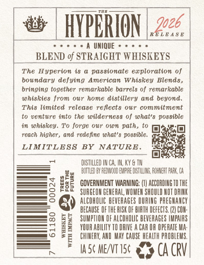
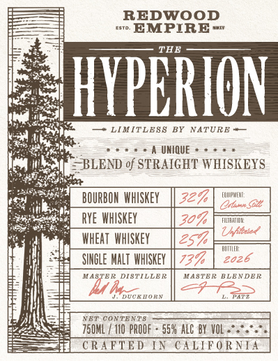

# TTB COLA Label Images - TTBID 26181001000145

**Brand Name:** REDWOOD EMPIRE

**Fanciful Name:** THE HYPERION

**Issue Date:** 07/06/2026

**Origin Code:** 01

**Product Class/Type:** 120

**Source:** [TTB Public COLA Registry](https://ttbonline.gov/colasonline/viewColaDetails.do?action=publicFormDisplay&ttbid=26181001000145)

## Label Images

### Back Label

### Label 1

### Label 3

## Extracted Label Text

*Text extracted via OCR - may contain errors*

### Back Label

603
HYPPRION
R€LEA $ E
UNIQUE
BLEND of STRAIGHT WHISKEYS
The
Hyperion i8
passionate ecploration of
boundary defying
American Whiskey Blend8,
bringing together remarkable barrels of remarkable
whiskies from O1r home distillery and beyond:
This limited
release reflects our
comm Itment
to venture into the wilderness 0f what'8 possible
whiskey. To forge OUr" Own path, t0
reach higher , and redefine ihat' =
possIble.
LIMITLESS
BY
NATURE
DISTLLED |R Ca,
KY & TM
BOTTLed EY FECMOOD ENPIFE [STILLAZ FOHMERT PARK CA
h
GOVERNMENT WARNING:
ACLOADING TO ThE
2
SURGEOH GENERAL, WOMEH ShDULD NOT DRINK
ALCOHOLC BEVERAGES DUAIHG PAEGHANCE
BECAUSE OF THE HUSK OF BIATH DEFECTS 42| COH:
SUMFTLOH OF ALCOHOLC BEVERAGES /MPALAS
I
YDUR abilhty TI QAIVE
CAR OR OPEAATE Ma:
CHIHEAX, AxD  MAY CAUSE HEALTH PROBLEMS.
IA 5 ME/NT 15c
CA CRV
2o26

### Label 1

REDWOOD
EMPIRE
THE
HYPERION
LIMITLFSS
NATURE
UNIQUE
~BLEND of STRAIGHT WHISKEYS
BOURBON  WhISKEY
327
LQUUPRUCME;
OinnS
Rye WhISKEY
309
Mh
Unfaated
WheAT  whSKeY
257
SihGLE MaLT WHISKEY
737
2026
KASTER DISTTLLER
MASTBE BLENDER
M 4
24
JVorRarv
NET ConteNT8
750ML
1IO PROOF
558alc By VOL +*
CRAFTED LN
CALLFORNLA

### Label 3

THE

A

ON

4 HIDDEN

‘ALIFORNIA,

THE TALLEST KNO}

EON THE PLANET.

sores

aercis

won

Tatauin | wocavion | bar/eoNo

nt AeawooD [v9 YEARS

WAT

acawo00s

THANK
