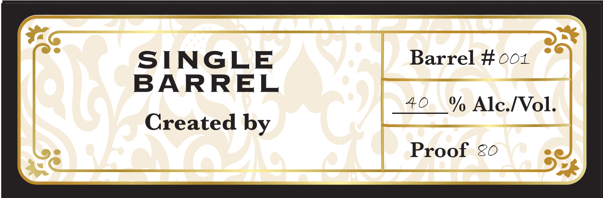
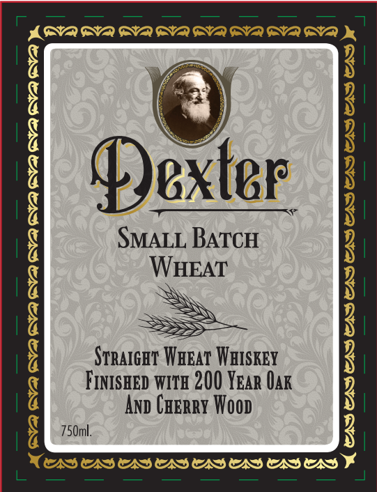

# TTB COLA Label Images - TTBID 26181001000166

**Brand Name:** DEXTER

**Fanciful Name:** SMALL BATCH WHEAT

**Issue Date:** 07/08/2026

**Origin Code:** 09

**Product Class/Type:** 109

**Source:** [TTB Public COLA Registry](https://ttbonline.gov/colasonline/viewColaDetails.do?action=publicFormDisplay&ttbid=26181001000166)

## Label Images

### Back Label

### Front Label

## Extracted Label Text

*Text extracted via OCR - may contain errors*

**Detected Proof:** 80

### Back Label

SINGLE
Barrel # 001
BARREL
40
% Alc [ol:
Created by
Proof
8

### Front Label

ADA DVA GVA GVA GVA GVA GVA BVA De

i

Dexter

SMALL BATCH

HEAT

STRAIGHT Warar WHISKEY

FINISHED WITH 200 YEAR OAK

Ano CHERRY Woop

750ml.

NAD ADASASADSADS ASAD
