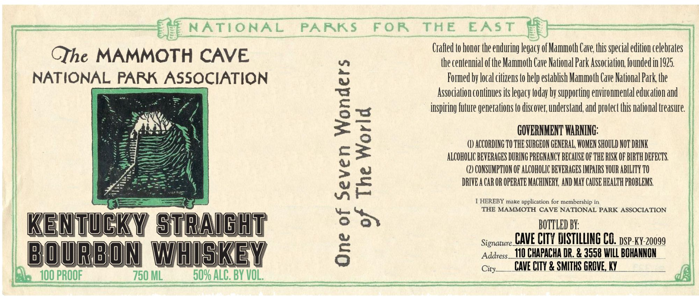

# TTB COLA Label Images - TTBID 26181001000187

**Brand Name:** THE MAMMOTH CAVE NATIONAL PARK ASSOCIATION

**Issue Date:** 07/06/2026

**Origin Code:** 22

**Product Class/Type:** 101

**Source:** [TTB Public COLA Registry](https://ttbonline.gov/colasonline/viewColaDetails.do?action=publicFormDisplay&ttbid=26181001000187)

## Label Images

### Label 1

## Extracted Label Text

*Text extracted via OCR - may contain errors*

**Detected Proof:** 100

### Label 1

NATIONAL
PARKS
FoR
THE
EAS T
Crafled to honor the enduring legacy o[ Mammoth Cave; Uhis special edition celebrates
CIhe MAMMOTH CAVE
the centennial ofthe Mammoth Cave National Park Association foundedin 1925
NATIONAL PARK ASSOCIATION
Formed by local citzens to help establish Mammoth Cave National Park the
6
Association contnues its Legacy today by supporting environmental education and
inspiring fulure generations (0 discovei;,understand and protect Uhis national treasure:
1
OAIUHHGTVTHEVHHGNIHEMMASHDXTIMAE
ALCOHOLIC BEVBRAGES DURING PREGNANCY BECAUSE OF THE RISK OF BIRTH DEFECTS
6
CONSUMPTION OF ALCOHOLIC BEVERAGES IMPAIRS YOUR ABILITY TO
2
DRIVE A CaR OR OPERATE MACHINERK  AND MAY CAUSE HEALTH PROBLEMS
HEREBY make application for membership in
THE MAMMOTH CAVE NATIONAL PARK ASSOCIATION
KEntUCKY straight
53
BOTTLED BY:
Signature_ CAVE CITY DISTILLNG GL dsp_ky 20099
BOURBON WHISKEY
3
Address_ I10 CHAPACHA DR. & 3558 WILL BOHANNON
City_
CAVE CITY & SMITHS GROVE, Ky
100 PROOF
750 ML
509 ALC. BY VOL;
