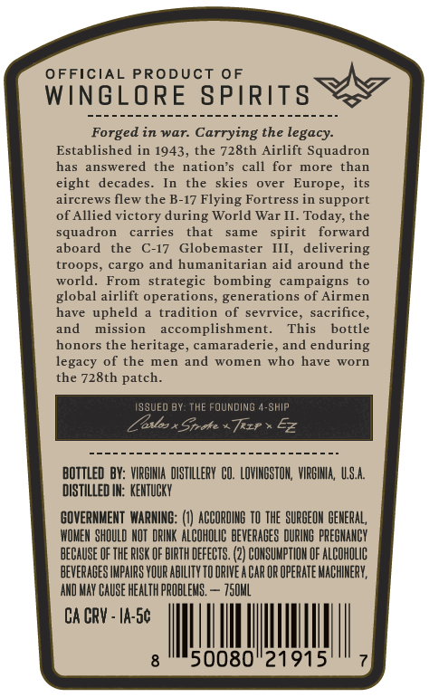
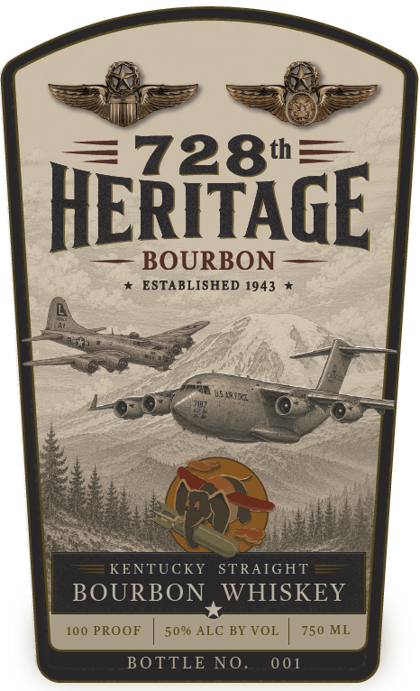

# TTB COLA Label Images - TTBID 26181001000215

**Brand Name:** 728TH HERITAGE

**Issue Date:** 07/07/2026

**Origin Code:** 05

**Product Class/Type:** 101

**Source:** [TTB Public COLA Registry](https://ttbonline.gov/colasonline/viewColaDetails.do?action=publicFormDisplay&ttbid=26181001000215)

## Label Images

### Back Label

### Front Label

## Extracted Label Text

*Text extracted via OCR - may contain errors*

**Detected Proof:** 100

### Back Label

OFFICIAL PRODUCT
OF
WInGLORE SPIRITS
Forged in war:
Carrying the legacy:
Established in 1943, the 728th Airlift Squadron
has answered
the
nation'$
call for
more than
eight
decades_
the
skies
over  Europe,
its
aircrews flew the B-17 Flying Fortress in support
of Allied victory during World War II. Today; the
squadron
carries
that
same
spirit
forward
aboard
the
C-17
Globemaster
III,
delivering
troops
cargo and humanitarian aid around the
world_
From
strategic bombing
campaigns
global airlift operations; generations of Airmen
have
upheld
tradition of sevrvice, sacrifice,
and
mission
accomplishment.
This
bottle
honors the
heritage, camaraderie
and
enduring
legacy
of the men
and
women
who have
worn
the 728th patch_
SSUED BY: THE FOUNDING 4-SHIP
Zedlos* Strete
Trzr
Ez
BottleD BY: VIRGINIA   distIllerY  CO. LOVIMBSTOH,  VIRBIHIA,  US.A
diSTILLED IK:  KENTUCKY
GOVERNMENT  WARNING:
ACCORDING TO ThE SURCEOK BENERAL,
WOMEM SHOULD HOT  DRIKK  ALCOHOLIC beveraGES DURING PRECMANCY
because OF thE RISK OF blrTh DEFECTS.
COHSUMPTIOH OF ALCOHOLIC
pevErabeS IMPaIRS VOUR AbiLIty TO ORIVE A Car OR Operate MacherV;
AND MAY CAUSE HEALTH PROBLEMS ,
750hL
CA CRV - Ia-Sc
50080"21915

### Front Label

728th3
HERHTAGE
BOURBON
ESTABLISHED 1943
KENTUCKY
STRAIGHT
BOURBON
WHISKEY
100 PROOF
50% ALC BY VOL
750 ML
BOTTLE NO.
0 01
Vtuic-
