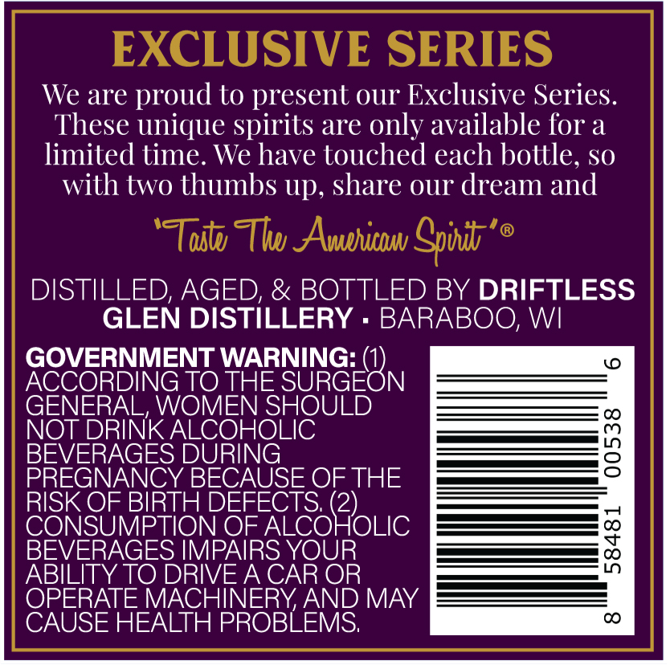
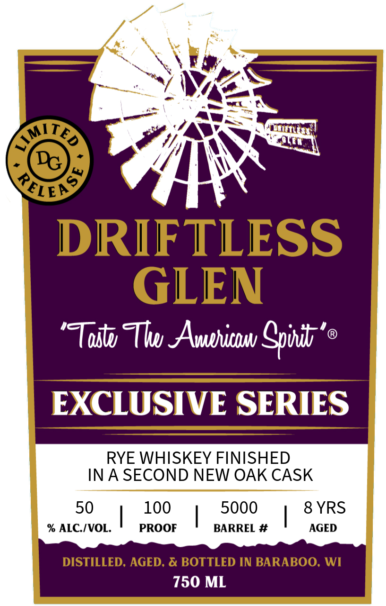

# TTB COLA Label Images - TTBID 26181001000224

**Brand Name:** DRIFTLESS GLEN

**Issue Date:** 07/06/2026

**Origin Code:** 48

**Product Class/Type:** 142

**Source:** [TTB Public COLA Registry](https://ttbonline.gov/colasonline/viewColaDetails.do?action=publicFormDisplay&ttbid=26181001000224)

## Label Images

### Back Label

### Front Label

## Extracted Label Text

*Text extracted via OCR - may contain errors*

**Detected Age:** 8 Years

### Back Label

EXCLUSIVE SERIES
We are proud to present our Exclusive Series.
These unique spirits are only available for a
limited time. We have touched each bottle, so
with two thumbs Up, share our dream and
'TTosu Thw AAvuehicbu Cpond
@
DISTILLED, AGED; & BOTTLED BY DRIFTLESS
GLEN DISTILLERY
BARABOO; WI
GOVERNMENT WARNING:
(
ACCORDING TO THE
SURGEON
GENERAL, WOMEN SHOULD
NOT DRINK ALCOHOLIC
BEVERAGES DURING
3
PREGNANCY BECAUSE OF THE
RISK OF BIRTH DEFECTS (2)
CONSUMPTION OF ALCOHOLIC
BEVERAGES IMPAIRS YOUR
11
ABILITY TO DRIVEA CAR OR
OPERATE MACHINERYAND MAY
CAUSE HEALTH PROBLEMS
CO

### Front Label

Tait Tw Awerienw Spirit ’®
EXCLUSIVE SERIES

RYE WHISKEY FINISHED
INA SECOND NEW OAK CASK

50 100 5000 8 YRS
% ALC./VOL. | PROOF BARREL # AGED
