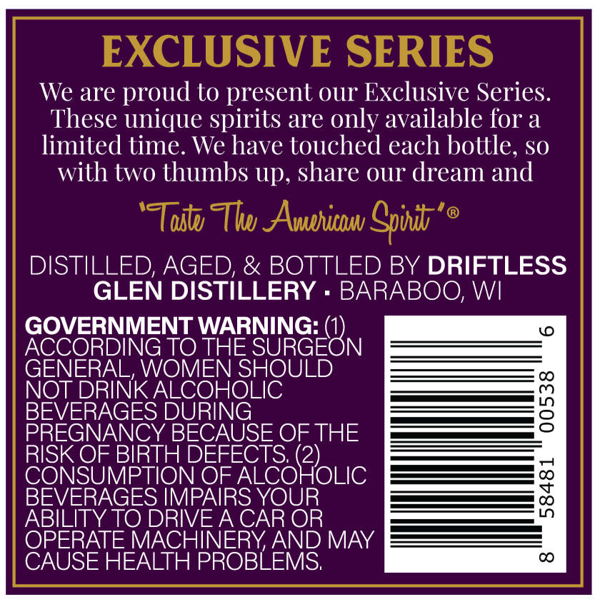
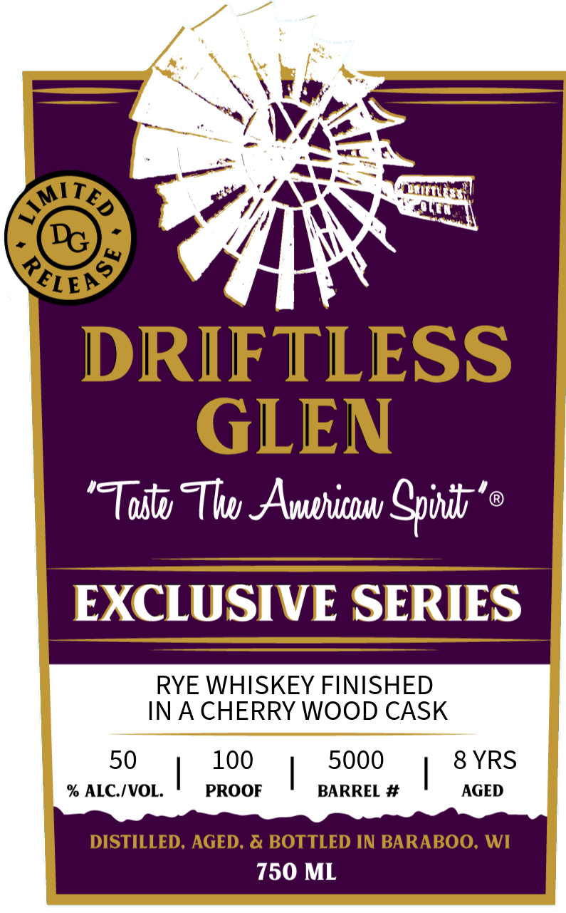

# TTB COLA Label Images - TTBID 26181001000244

**Brand Name:** DRIFTLESS GLEN

**Issue Date:** 07/07/2026

**Origin Code:** 48

**Product Class/Type:** 142

**Source:** [TTB Public COLA Registry](https://ttbonline.gov/colasonline/viewColaDetails.do?action=publicFormDisplay&ttbid=26181001000244)

## Label Images

### Back Label

### Front Label

## Extracted Label Text

*Text extracted via OCR - may contain errors*

**Detected Age:** 8 Years

### Back Label

EXCLUSIVE SERIES
We are proud to present ur Exclusive Series:
These unique spirits are only available for a
limited time. We have touched each bottle, so
with two thumbs Up, share our dream and
'Toatv Thwu AAvahinuv Spvdds"
@
DISTILLED, AGED; & BOTTLED BY DRIFTLESS
GLEN DISTILLERY
BARABOO; WI
GOVERNMENT WARNING:
SUGEOBN
0
ACCORDING TO THE
GENERAL, WOMEN SHOULD
NOT DRINKALCOHOLIC
BEVERAGES DURING
3
PREGNANCY BECAUSE OF THE
RISK OF BIRTH DEFECTS (2)_
CONSUMPTION OF ALCOHOLIC
BEVERAGES IMPAIRS YOUR
{1
ABILITYTO DRIVEA CAR OR
OPERATE MACHINERYAND MAY
CAUSE HEALTH PROBLEMS;
CO

### Front Label

6
Y
DRIFTLESS
GLEN
'TToutv Tlwu Avuphithu Gpuitb'
EXCLUSIVE SERIES
RYE WHISKEY FINISHED
IN A CHERRY WOOD CASK
50
100
5000
8 YRS
% ALC IVOL.
PROOF
BARREL #
AGED
DISTILLED, AGED; & BOTTLED IN BARABOO; WI
750 ML
TED
LIM
RELeY
