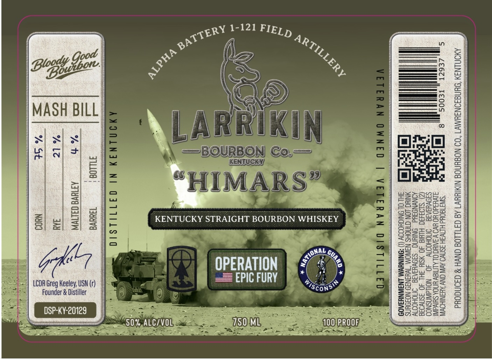

# TTB COLA Label Images - TTBID 26181001000269

**Brand Name:** LARRIKIN BOURBON CO

**Fanciful Name:** "HIMARS"

**Issue Date:** 07/31/2026

**Origin Code:** 22

**Product Class/Type:** 101

**Source:** [TTB Public COLA Registry](https://ttbonline.gov/colasonline/viewColaDetails.do?action=publicFormDisplay&ttbid=26181001000269)

## Label Images

### Label 1

## Extracted Label Text

*Text extracted via OCR - may contain errors*

### Label 1

“SINT IG0Ud HETV3H JSNWO AVN CNV AKANIHOWW
alld3d0 YO HVO V ANIC OL ALTIGW UNDA SHlVdINI
SA9VHIAIG = OMOHOIIY 40 NOLLdWNSNOD

£6 8 RS
3 (¢) ‘S193430 HIMIG 40 YSIH SHI 40 aSMvO3a
ol ia] AQNYNOSUd ONIUNG_ S39VHAAIG INOHODI

DINING LON CIMOHS NAWOM “TvHINI9 NOJOUNS
HL OL SNIGHOOOY (1) “ONINYYM LNAWNY3A05

EPIC FURY

OPERATION |

708) Tae
"Ah AVGORIVN
Le. aac
SW Sk ee Od

USN
¥-20129

K

Founder & Distiller

LCDR Greg Keeley,
DSP.
