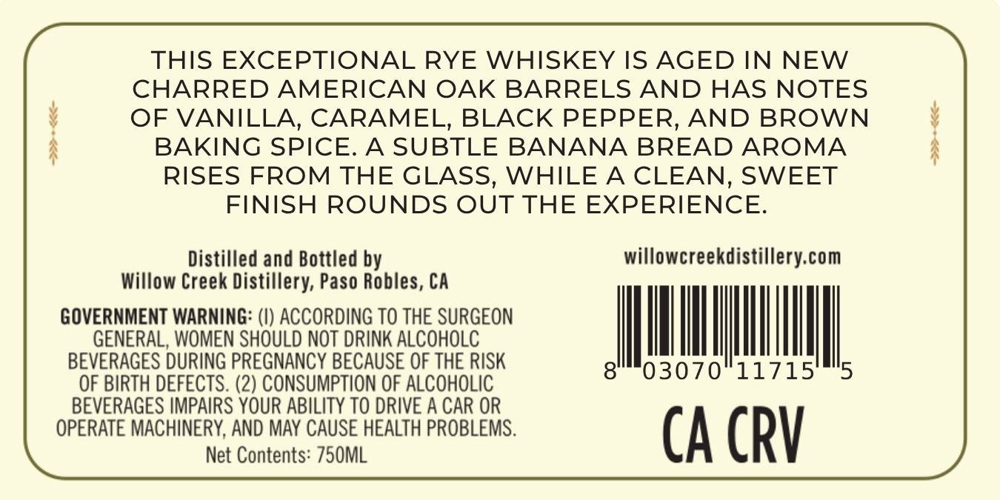

# TTB COLA Label Images - TTBID 26181001000290

**Brand Name:** WILLOW CREEK DISTILLERY

**Issue Date:** 07/06/2026

**Origin Code:** 01

**Product Class/Type:** 142

**Source:** [TTB Public COLA Registry](https://ttbonline.gov/colasonline/viewColaDetails.do?action=publicFormDisplay&ttbid=26181001000290)

## Label Images

### Back Label

### Front Label

## Extracted Label Text

*Text extracted via OCR - may contain errors*

*1 image(s) excluded: text did not meet readability threshold*

### Back Label

THIS EXCEPTIONAL RYE WHISKEY IS AGED IN NEW
CHARRED AMERICAN OAK BARRELS AND HAS NOTES
OF VANILLA, CARAMEL, BLACK PEPPER, AND BROWN
BAKING SPICE:
A SUBTLE BANANA
BREAD AROMA
RISES FROM THE GLASS,
WHILE A
CLEAN, SWEET
FINISH ROUNDS OUT THE EXPERIENCE:
Distilled and Bottled by
willowcreekdistillery com
Willow Creek Distillery; Paso Robles, CA
GOVERNMENT WARNING: (V) ACCORDING TO THE SURGEON
GENERAL, WOMEN SHOULD NOT DRINK ALCOHOLC
BEVERAGES DURING PREGNANCY BECAUSE OF THE RISK
8
03070
11715'
5
OF BIRTH DEFECTS . (2) CONSUMPTION OF ALCOHOLIC
BEVERAGES IMPAIRS YOUR ABILITY TO DRIVE A CAR OR
OPERATE MACHINERY, AND MAY CAUSE HEALTH PROBLEMS.
CA CRV
Net Contents: 750ML
