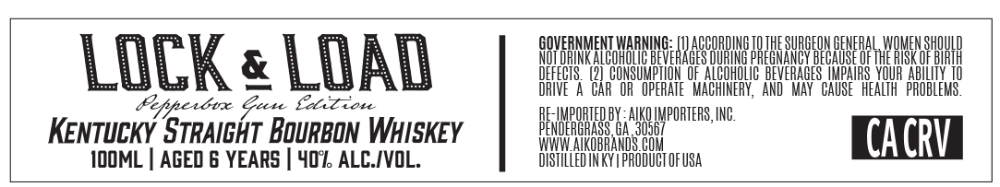

# TTB COLA Label Images - TTBID 26181001000370

**Brand Name:** LOCK & LOAD

**Issue Date:** 07/06/2026

**Origin Code:** 08

**Product Class/Type:** 101

**Source:** [TTB Public COLA Registry](https://ttbonline.gov/colasonline/viewColaDetails.do?action=publicFormDisplay&ttbid=26181001000370)

## Label Images

### Front Label

## Extracted Label Text

*Text extracted via OCR - may contain errors*

**Detected Age:** 6 Years

### Front Label

GOVERNMENT ARMM: ARDC SRG EYER MHD
& NOTING ALGOMOLIG BEVERAGES DURING PREGNANGY BECAUSE OF TE ISK OF BIRTH
DEFECTS. (2) CONSUMPTION OF ALCOHOLIC: BEVERAGES IMPAIRS YOUR ABILITY TO
= Cag zis DRIVE A CAR’ OR OPERATE MACHINERY, AND’ MAY CAUSE HEALTH’ PROBLEMS
Upperton Gece: Eoict ste AE-IMPORTEDBY AKO IMPORTERS, ING
KENTUCKY STRAIGHT BOURBON WHISKEY TAIEIGSS SI CACRV
TOOML | AGED 6 YEARS | 407, ALC./VOL. DISTILLED INKY PRODUCT OFUSA
