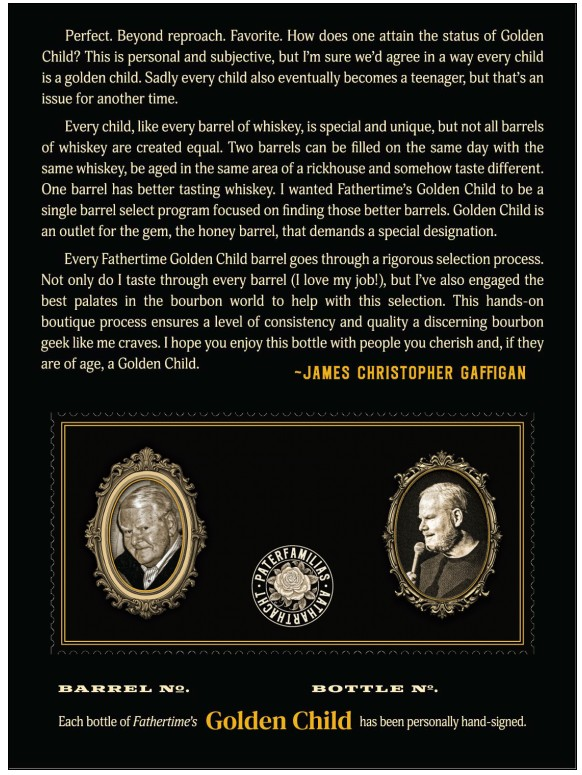
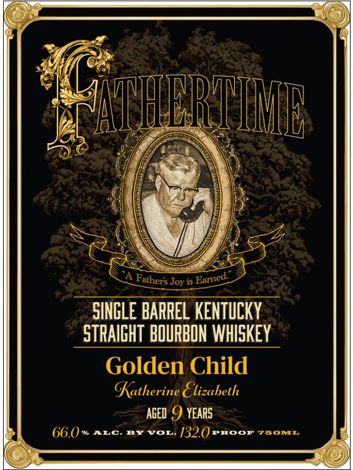
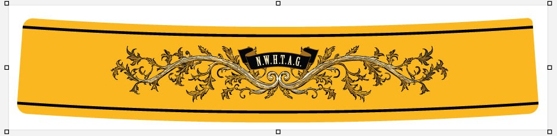
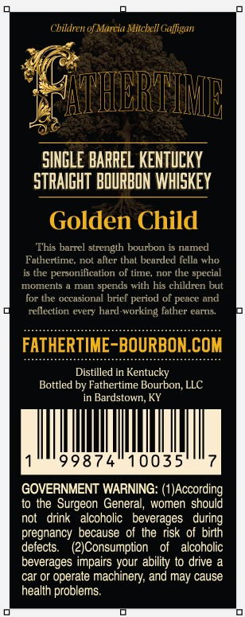

# TTB COLA Label Images - TTBID 26181001000385

**Brand Name:** FATHERTIME

**Issue Date:** 07/08/2026

**Origin Code:** 22

**Product Class/Type:** 101

**Source:** [TTB Public COLA Registry](https://ttbonline.gov/colasonline/viewColaDetails.do?action=publicFormDisplay&ttbid=26181001000385)

## Label Images

### Back Label

### Label 1

### Label 2

### Label 3

## Extracted Label Text

*Text extracted via OCR - may contain errors*

*1 image(s) excluded: text did not meet readability threshold*

### Back Label

Perfect. Beyond reproach: Favorite: How does one attain the status of Golden
Child? This is personal and subjective; but Fm sure we'd agree in a way every child
is a golden child: Sadly every child also eventually becomes =
teenager; but that'$ an
issue for another time;
Every child; like every barrel of whiskey; is special and unique, but not all barrels
of whiskey are created equal Two barrels can be
on the same day with the
same
whiskey, be aged in the same area of a rickhouse and somehow taste different:
One barrel has better tasting
wanted Fathertime $ Golden Child to be
single barrel select program focused on
those better barrels. Golden Child is
an outlet for the gem, the
barrel, that demands
special designation.
Every Fathertime Golden Child barrel
through
rigorous selection process
Not only do
taste through every barrel ([ love my jobl) but Tve also engaged the
best
in  the bourbon world
with this   selection. This hands-on
boutique process ensures
level of consistency and quality
discerning bourbon
like me craves:
you enjoy this bottle with people you cherish _
if they
are of age,
Golden Child.
~JAMES CHRISTOPHER GAFFIGAN
BARREL
Jiao
BOTTLE IJ"
Each bottle of Fathertine $
Golden Child has been personally hand-signed
filled
whiskey:
finding
honey
goes
palates
help
geek _
Thope
and,

### Label 1

LANHHBRTIUI
Joy is
SINGLE BARREL KENTUCKY
STRAGHT BQURBON WHISKEY
Golden Child
Katherine €lizabeth
AGED
YEARS
66.0
ALc#Y
Vor
132.0
Proor
7BOML
Earned
Fathers

### Label 3

Children of Marcia Mitchell Gafigan
VAMHREIURB
SINGLE BaRREL KENTUCKY
STRAIGHT BOURBON whISKEY
Golden Child
This barrel strength bourbon is named
Fathertime
not alter that bearded fella who
is the
personification of time, nor the special
moments
man
spends with his children but
for the occasional brief period of peace and
rellection every hard-working father earns
FATHERTIME-BOURBON.COM
Distilled in Kentucky
Bottled by Fathertime Bourbon; LLC
in Bardstown,
99874
10035
GOVERNMENT WARNING: (1)According
to the Surgeon General,
women
should
not   drink   alcoholic
beverages   during
pregnancy because of the risk of birth
defects:
2)Consumption
alcoholic
beverages impairs your ability to drive &
car or operate machinery; and may cause
health problems:
