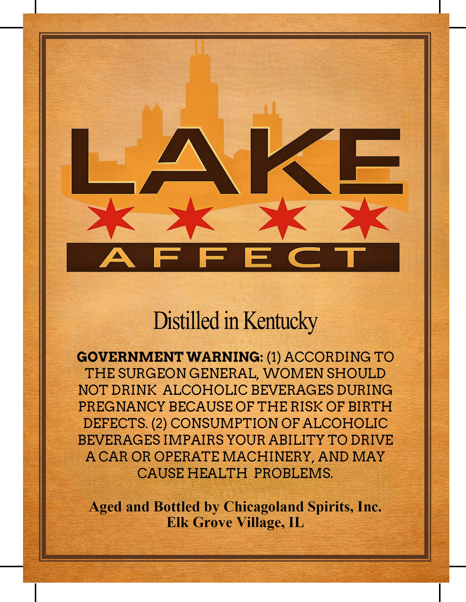
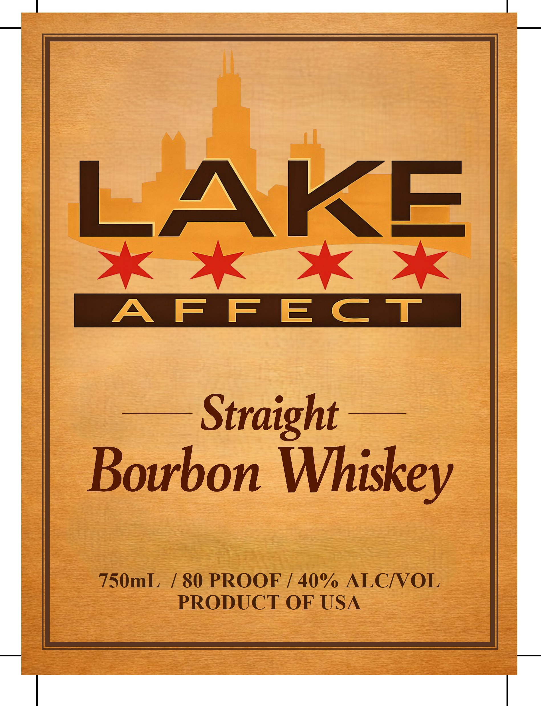

# TTB COLA Label Images - TTBID 26181001000389

**Brand Name:** LAKE AFFECT

**Issue Date:** 07/06/2026

**Origin Code:** 04

**Product Class/Type:** 101

**Source:** [TTB Public COLA Registry](https://ttbonline.gov/colasonline/viewColaDetails.do?action=publicFormDisplay&ttbid=26181001000389)

## Label Images

### Back Label

### Front Label

## Extracted Label Text

*Text extracted via OCR - may contain errors*

**Detected Proof:** 80

### Back Label

LAKE
A F FECT
Distilled in Kentucky
GOVERNMENT WARNING: (1) ACCORDING TO
THE SURGEON GENERAL, WOMEN SHOULD
NOT DRINK ALCOHOLIC BEVERAGES DURING
PREGNANCY BECAUSE OF THE RISK OF BIRTH
DEFECTS: (2) CONSUMPTION OF ALCOHOLIC
BEVERAGES IMPAIRS YOUR ABILITY TO DRIVE
A CAR OR OPERATE MACHINERY_
AND MAY
CAUSE HEALTH PROBLEMS:
Aged and Bottled by Chicagoland Spirits, Inc
Elk Grove Village, IL

### Front Label

LAKE
A F FECt
Straight
Bourbon Whiskey
750mL
[ 80 PROOF
40% ALCIOL
PRODUCT OF USA
