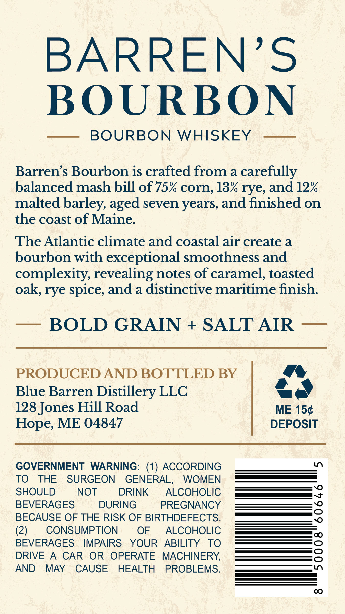
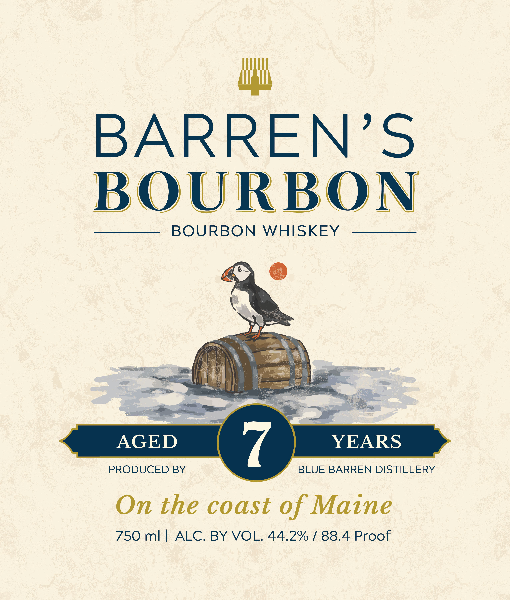

# TTB COLA Label Images - TTBID 26181001000399

**Brand Name:** BARREN'S

**Issue Date:** 07/09/2026

**Origin Code:** 24

**Product Class/Type:** 141

**Source:** [TTB Public COLA Registry](https://ttbonline.gov/colasonline/viewColaDetails.do?action=publicFormDisplay&ttbid=26181001000399)

## Label Images

### Back Label

### Front Label

## Extracted Label Text

*Text extracted via OCR - may contain errors*

**Detected Proof:** 88.4
**Detected Age:** 7 Years

### Back Label

BARREN'S
BOURBON
BOURBON
WHISKEY
Barren's Bourbon is crafted from a carefully
balanced mash bill of 75% corn, 13% rye, and 12%
malted barley, aged seven years, and finished on
the coast of Maine.
The Atlantic climate and coastal air create a
bourbon with exceptional smoothness and
complexity, revealing notes of caramel, toasted
oak, rye spice; and a distinctive maritime finish:
BOLD GRAIN
+
SALT AIR
PRODUCED AND BOTTLED BY
Blue Barren Distillery LLC
128 Jones Hill Road
ME 154
Hope, ME 04847
DEPOSIT
GOVERNMENT
WARNING: (1) ACCORDING
TO
THE
SURGEON
GENERAL;
WOMEN
SHOULD
NOT
DRINK
ALCOHOLIC
BEVERAGES
DURING
PREGNANCY
3
BECAUSE OF THE RISK OF BIRTHDEFECTS.
(2)
CONSUMPTION
OF
ALCOHOLIC
BEVERAGES
IMPAIRS
YOUR
ABILITY
TO
DRIVE
A
CAR
OR
OPERATE
MACHINERY
17
AND
MAY
CAUSE
HEALTH
PROBLEMS:
0O

### Front Label

BARREN'S
BOURBON
BOURBON
WHISKEY
AGED
7
YEARS
PRODUCED BY
BLUE BARREN DISTILLERY
On the coast of Maine
750 ml /
ALC. BY VOL. 44.2% /88.4 Proof
