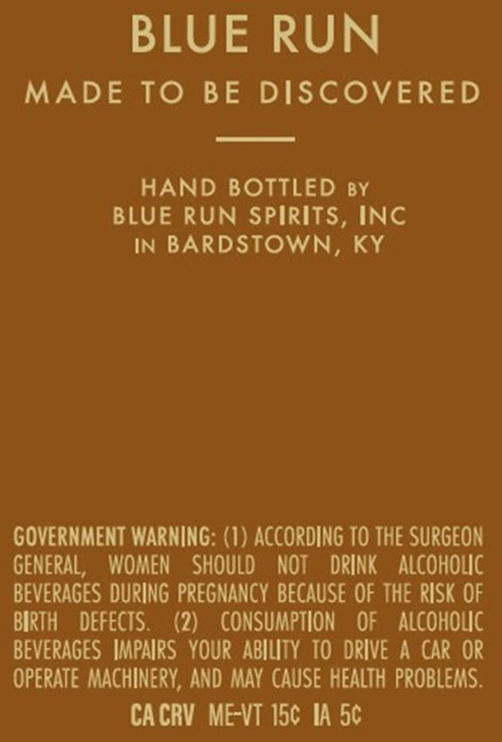
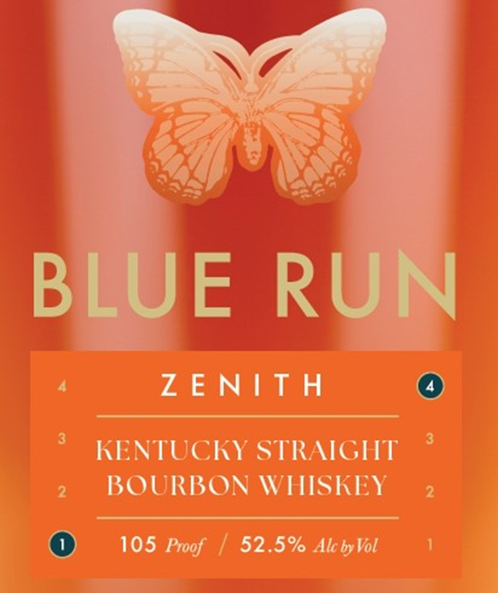
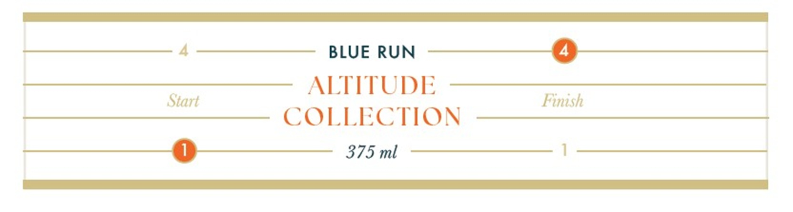

# TTB COLA Label Images - TTBID 26181001000525

**Brand Name:** BLUE RUN

**Issue Date:** 07/06/2026

**Origin Code:** 22

**Product Class/Type:** 101

**Source:** [TTB Public COLA Registry](https://ttbonline.gov/colasonline/viewColaDetails.do?action=publicFormDisplay&ttbid=26181001000525)

## Label Images

### Back Label

### Label 1

### Label 3

## Extracted Label Text

*Text extracted via OCR - may contain errors*

**Detected Proof:** 105

### Back Label

BLUE RUN

MADE TO BE DISCOVERED

HAND BOTTLED sy

BLUE RUN SPIRITS, INC

IN BARDSTOWN, KY

GOVERNMENT WARNING: (1) ACCORDING TO THE SURGEON

GENERAL, WOMEN SHOULD NOT DRINK ALCOHOLIC

BEVERAGES DURING PREGNANCY BECAUSE OF THE RISK OF

BIRTH DEFECTS.

(2) CONSUMPTION OF ALCOHOLIC

BEVERAGES IMPAIRS YOUR ABILITY TO DRIVE A CAR OR

OPERATE MACHINERY, AND MAY CAUSE HEALTH PROBLEMS.

CACRV ME-VT 15¢ IA 5¢

### Label 1

BLUE
RUN
Z E NIT H
KENTUCKY STRAIGHT
BOURBON WHISKEY
105 Proof
52.5% Alc by Vol

### Label 3

BLUE RUN
ALTITUDE
Start
Finash
COLLECTION
375 ml
