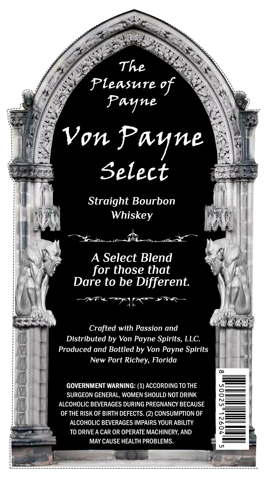
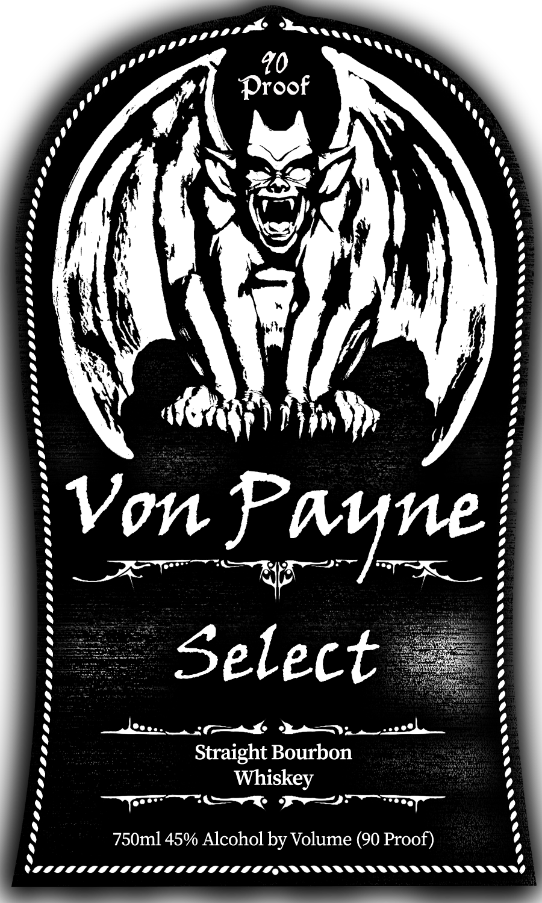

# TTB COLA Label Images - TTBID 26181001000614

**Brand Name:** VON PAYNE

**Fanciful Name:** SELECT

**Issue Date:** 07/07/2026

**Origin Code:** 16

**Product Class/Type:** 101

**Source:** [TTB Public COLA Registry](https://ttbonline.gov/colasonline/viewColaDetails.do?action=publicFormDisplay&ttbid=26181001000614)

## Label Images

### Back Label

### Front Label

### Label 3

## Extracted Label Text

*Text extracted via OCR - may contain errors*

*1 image(s) excluded: text did not meet readability threshold*

**Detected Proof:** 80

### Back Label

The
Pleasure %f
Panne
Von Pane
Select
Straight Bourbon
Whiskey
A Select Blend
for those that
Dare to be Different:
Crafted with Passion and
Distributed by Von Payne Spirits, LLC:
Produced and Bottled by Von Payne Spirits
New Port Richey, Florida
GOVERNMENT WARNING: (1) ACCORDING TO THE
SURGEON GENERAL, WOMEN SHOULD NOT DRINK
{
ALCOHOLIC BEVERAGES DURING PREGNANCY BECAUSE
OF THE RISK OF BIRTH DEFECTS. (2) CONSUMPTION OF
ALCOHOLIC BEVERAGES IMPAIRS YOUR ABILITY
2
TO DRIVE A CAR OR OPERATE MACHINERY,AND
MAY CAUSE HEALTH PROBLEMS.

### Front Label

40
Proof
Von Fane
Select
Straight Bourbon
Whiskey
750ml 45% Alcohol by Volume (90 Proof)
