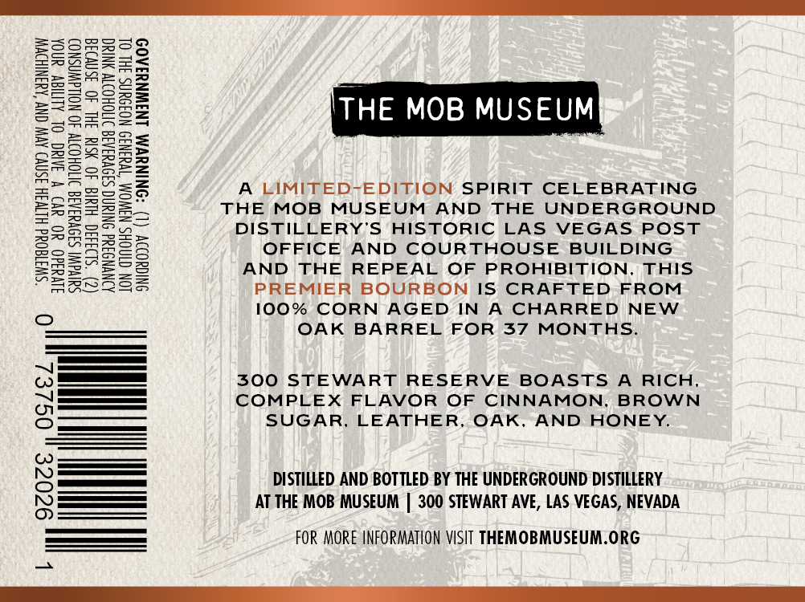
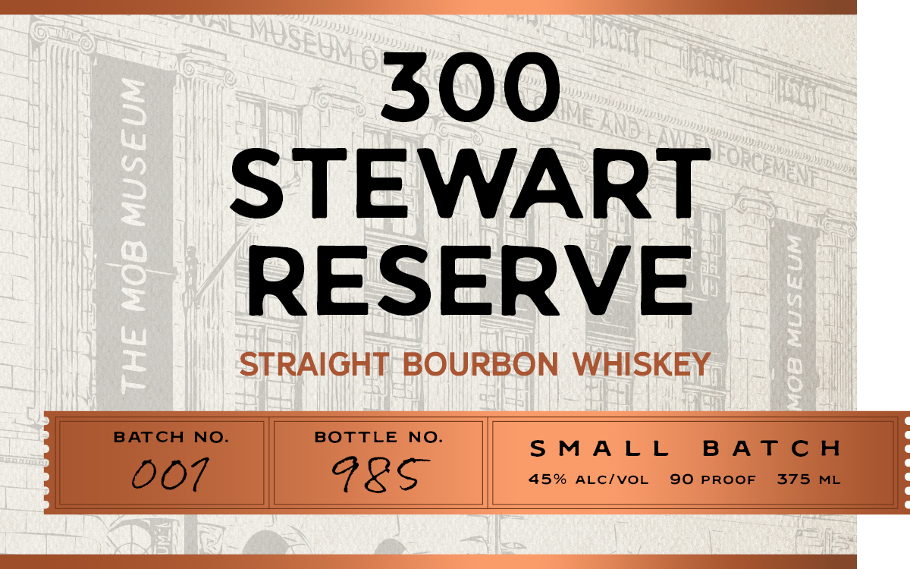
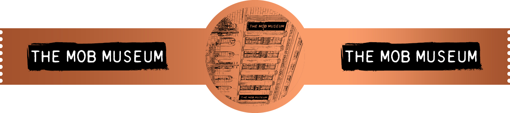

# TTB COLA Label Images - TTBID 26181001000653

**Brand Name:** THE MOB MUSEUM

**Fanciful Name:** 300 STEWART RESERVE

**Issue Date:** 07/06/2026

**Origin Code:** 32

**Product Class/Type:** 101

**Source:** [TTB Public COLA Registry](https://ttbonline.gov/colasonline/viewColaDetails.do?action=publicFormDisplay&ttbid=26181001000653)

## Label Images

### Back Label

### Front Label

### Label 3

## Extracted Label Text

*Text extracted via OCR - may contain errors*

### Back Label

SONINUVM LNGWNYIA0D

“SWHIGONd HETVIH 3SNV) AVW CNV ‘AYSNIHOVW
UWHd0 YO BV) V AAMC OL ALMAY anor
SUIVaW! SA9VAIAIE ITTOHODW 40 NOLAWNSNO)
(2) “SI9343d Hild 40 Sid IHL 40 3SnvI3a
AONVNOIAd ONIN S39VAIATA INOHODT YNIC
JON CINOHS N3WOM “TVYINI9 NOIDUNS IHL OL

ONIGYOD (L

j=)

THE MOB MUSE

A LIMITED-EDITION SPIRIT CELEBRATING
THE MOB MUSEUM AND THE UNDERGROUND
DISTILLERY’S HISTORIC LAS VEGAS POST
OFFICE AND COURTHOUSE BUILDING
AND THE REPEAL OF PROHIBITION. THIS
PREMIER BOURBON IS CRAFTED FROM
100% CORN AGED IN A CHARRED NEW
OAK BARREL FOR 37 MONTHS.

300 STEWART RESERVE BOASTS A RICH,
COMPLEX FLAVOR OF CINNAMON, BROWN
SUGAR, LEATHER, OAK, AND HONEY.

DISTILLED AND BOTTLED BY THE UNDERGROUND DISTILLERY
AT THE MOB MUSEUM | 300 STEWART AVE, LAS VEGAS, NEVADA

FOR MORE INFORMATION VISIT THEMOBMUSEUM.ORG

### Front Label

500
STEWART
RESERVE
Meee gee | one

### Label 3

THE MCB MUSEUX
THE MOB MUSEUM
THE MOB MUSEUM
AOCEDA
