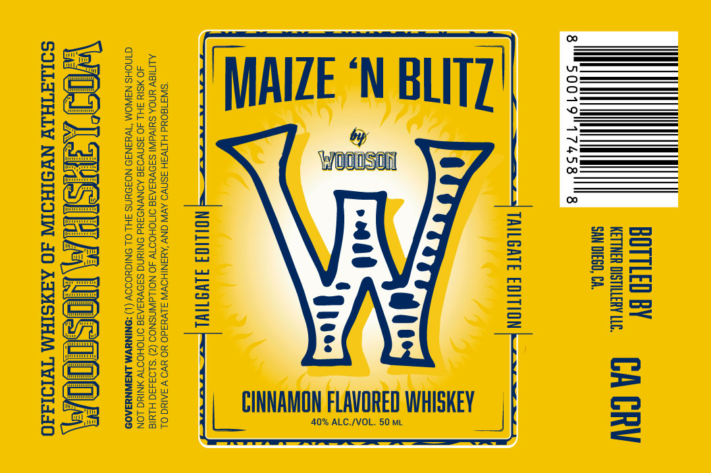

# TTB COLA Label Images - TTBID 26181001000672

**Brand Name:** WOODSON

**Fanciful Name:** MAIZE 'N BLITZ

**Issue Date:** 07/07/2026

**Origin Code:** 01

**Product Class/Type:** 149

**Source:** [TTB Public COLA Registry](https://ttbonline.gov/colasonline/viewColaDetails.do?action=publicFormDisplay&ttbid=26181001000672)

## Label Images

### Front Label

## Extracted Label Text

*Text extracted via OCR - may contain errors*

**Detected Proof:** 80

### Front Label

SE emCRIERY

SAN DIEGO, CA.

TAILGATE EDITION

=)

ED WHISKEY

40% ALC./VOL. 50 ML

NBLITZ'

ON FLAVO

MAIZE
|_SINNAM

NOLO] FLWOTIYL

‘SW318OUd H.LTVSH SSNV9 AVN ONY ‘AUSINIHOWIN S.LVuad0 YO YVO V SAIN OL
ALITISY UNOA SUIVAWNI SIOVUIAIE OMIOHOOTW 4O NOLLAWNSNOO (2) S103430 HINIE
4O ¥SIX SH 4O ASNVOIG AONVNOUd ONIUNG SI9VYSATS OMOHOOTW ANING LON
@INCHS N3WOM "W43NI9 NOZOUNS 3H! OL ONIGYODOY (1) *9NINUWM LNSIWNYAAOS

SOLLETHLY NYSIHOIN 40 ‘AAMSIHM TwId1d40
