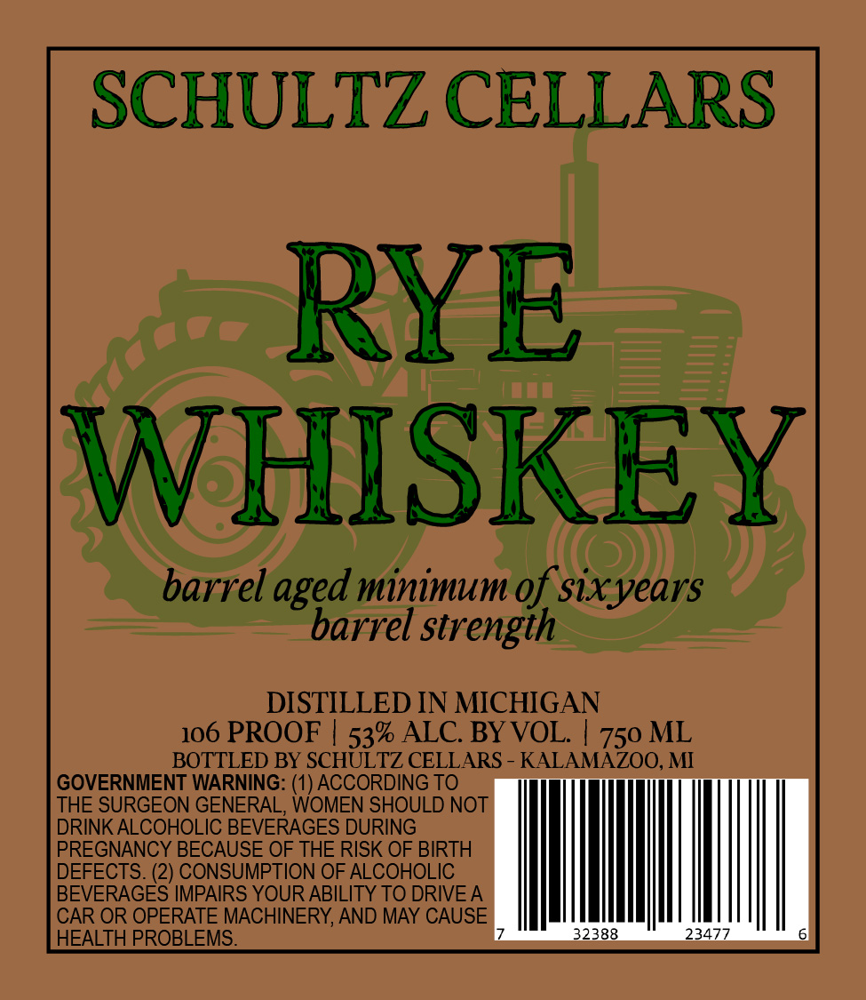

# TTB COLA Label Images - TTBID 26181001000791

**Brand Name:** SCHULTZ CELLARS

**Issue Date:** 07/06/2026

**Origin Code:** 06

**Product Class/Type:** 142

**Source:** [TTB Public COLA Registry](https://ttbonline.gov/colasonline/viewColaDetails.do?action=publicFormDisplay&ttbid=26181001000791)

## Label Images

### Label 1

## Extracted Label Text

*Text extracted via OCR - may contain errors*

**Detected Proof:** 106

### Label 1

SCHULTZ CELLARS

RYE

WHISKEY

barrel aged minimum of sixyears

barrel strength

DISTILLED IN MICHIGAN

106 PROOF | 53% ALC. BY VOL. | 750 ML

BOTTLED BY SCHULTZ CELLARS - KALAMAZOO, MI

GOVERNMENT WARNING: (1) ACCORDING TO

THE SURGEON GENERAL, WOMEN SHOULD NOT

DRINK ALCOHOLIC BEVERAGES DURING

PREGNANCY BECAUSE OF THE RISK OF BIRTH

DEFECTS. (2) CONSUMPTION OF ALCOHOLIC

BEVERAGES IMPAIRS YOUR ABILITY TO DRIVEA

CAR OR OPERATE MACHINERY, AND MAY CAUSE

HEALTH PROBLEMS.
