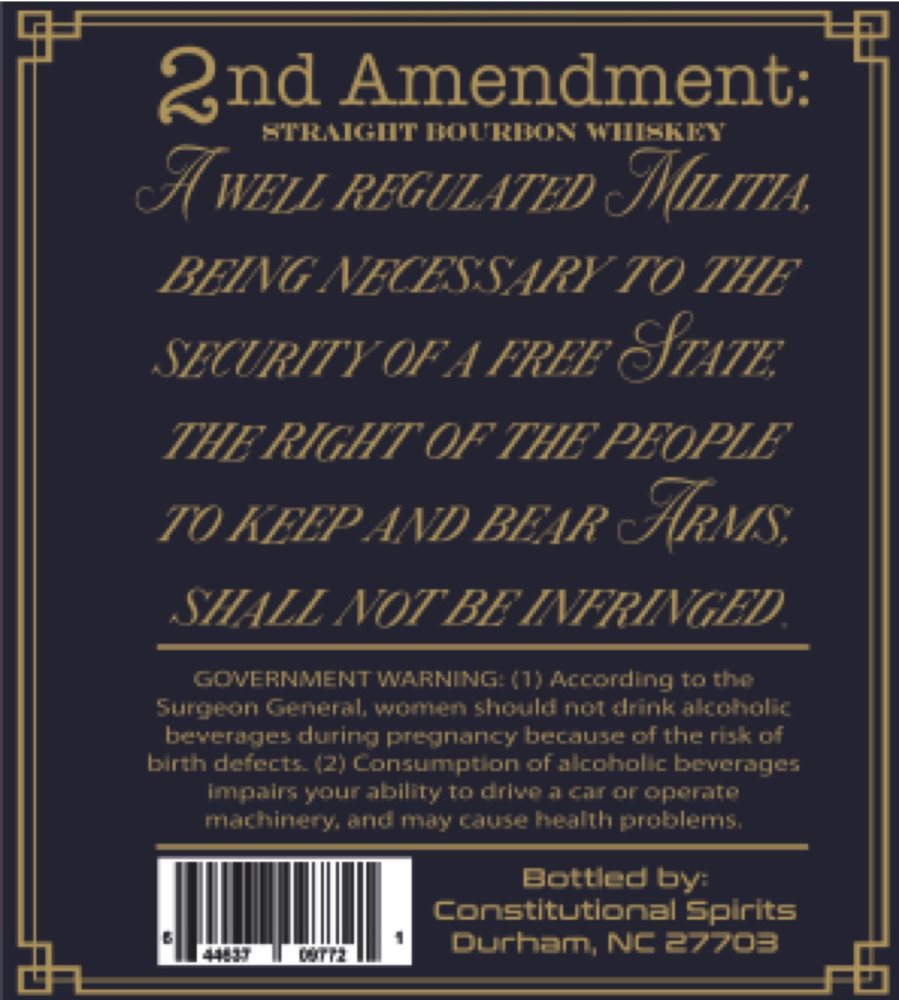
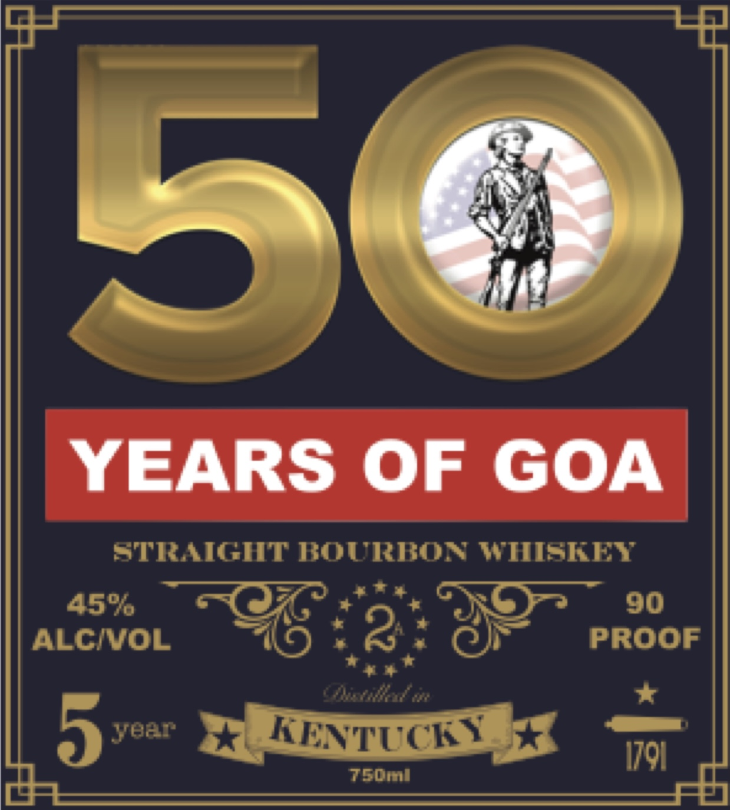

# TTB COLA Label Images - TTBID 26181001000800

**Brand Name:** 50 YEARS OF GOA

**Issue Date:** 07/06/2026

**Origin Code:** 35

**Product Class/Type:** 101

**Source:** [TTB Public COLA Registry](https://ttbonline.gov/colasonline/viewColaDetails.do?action=publicFormDisplay&ttbid=26181001000800)

## Label Images

### Back Label

### Label 1

## Extracted Label Text

*Text extracted via OCR - may contain errors*

### Back Label

Qnd Amendment:
ETRUCT ]ouritoN WMekRY
I WELL REGULATED
BEING NECESSARY TO THE
SECURITY UF AIREE
STATE
THHE RIGHT OF THE PEOPLE
TO KELP AND BEAR
cArvs
STHLL NOT BE INFRINGED
GOVERNMENTWARNING (1) Acrording to the
Surpeon General; womien should not drink akoholic
bever ges durin  PTegnancy because cftheruk of
birth deiects42) Consumpiion ofalcoholic beverages
Impzins yourability To driveataroroperte
machinety and moy cause heahh problers;
BotuCd
constitutlonal
Spirits
Durhan  Nc27703
MLITA
by:

### Label 1

YEARS
OF
GOA
STRAGHT BOURKON WIISIEY
4586
90
ALCIVOL
8
PROOF
5
Ybar
KENTUCEY
I7q1
750mi
