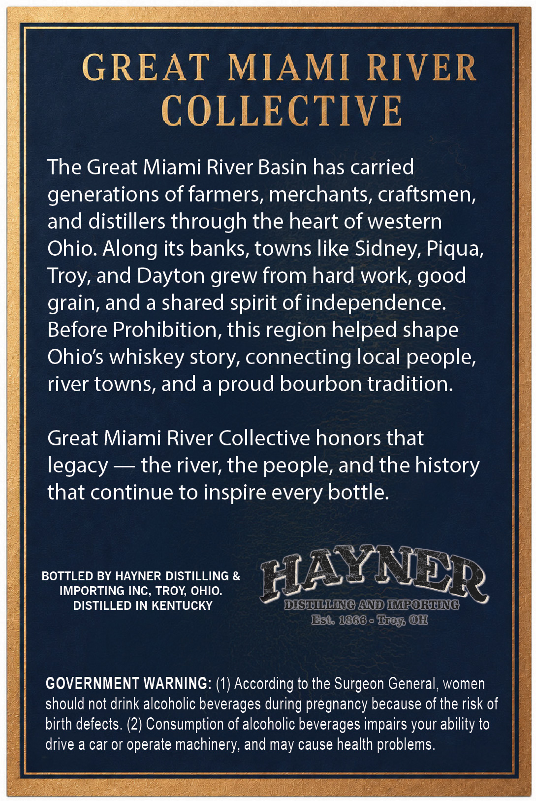
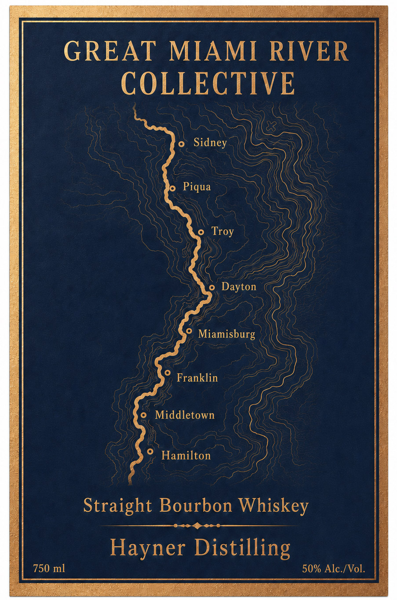

# TTB COLA Label Images - TTBID 26182001000047

**Brand Name:** HAYNER DISTILLING

**Fanciful Name:** GREAT MIAMI RIVER COLLECTIVE

**Issue Date:** 07/06/2026

**Origin Code:** 09

**Product Class/Type:** 101

**Source:** [TTB Public COLA Registry](https://ttbonline.gov/colasonline/viewColaDetails.do?action=publicFormDisplay&ttbid=26182001000047)

## Label Images

### Back Label

### Front Label

## Extracted Label Text

*Text extracted via OCR - may contain errors*

**Detected Proof:** 100

### Back Label

GREAT MIAMI RIVER

COLLECTIVE

The Great Miami River Basin has carried

generations of farmers, merchants, craftsmen

and distillers through the heart of western

Ohio. Along its banks, towns like Sidney, Piqua

Troy, and Dayton grew from hard work, good

grain, and a shared spirit of independence

Before Prohibition, this region helped shape

Ohio's whiskey story, connecting local people

river towns, and a proud bourbon tradition

Great Miami River Collective honors that

legacy — the river, the people, and the history

that continue to inspire every bottle

BOTTLED BY HAYNER DISTILLING &

IMPORTING INC, TROY, OHIO.

PLAIN aD)

DISTILLED IN KENTUCKY

7 TSR AN D}IVEO REIN G]

NERO

st, 1888 o Teg, OH

GOVERNMENT WARNING: (1) According to the Surgeon General, women

should not drink alcoholic beverages during pregnancy because of the risk of

birth defects. (2) Consumption of alcoholic beverages impairs your ability to

drive a car or operate machinery, and may cause health problems

INS A

### Front Label

GREAT
MIAMI RIVER
COLLECTIVE
Sidney
Piqua
Dayton
Miamisburg
Franklin
Middletown
Hamilton
Straight Bourbon Whiskey
Hayner Distilling
750 ml
50% Alc /Vol.
Troy
