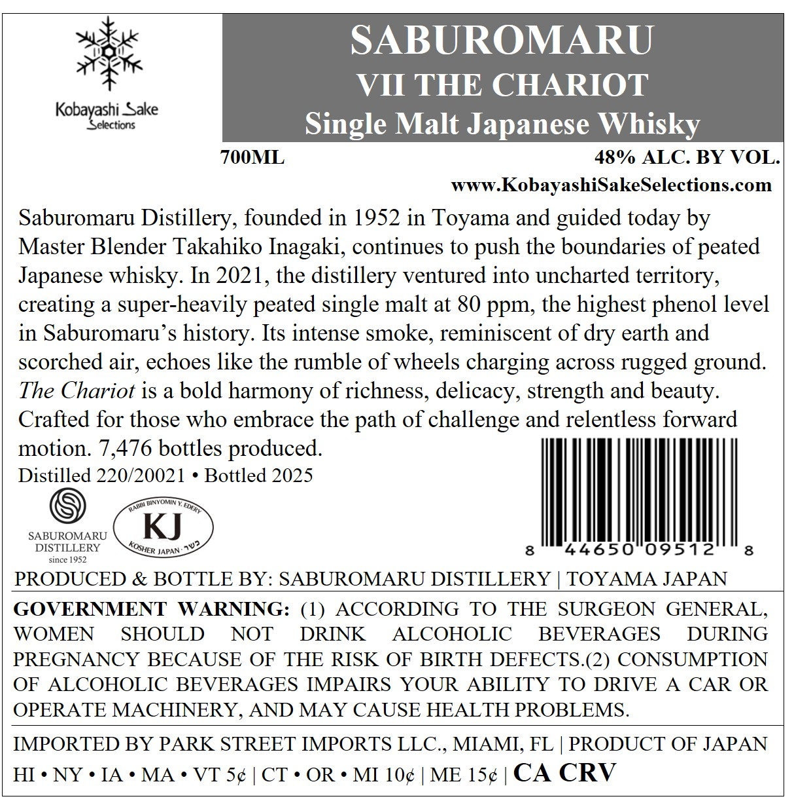
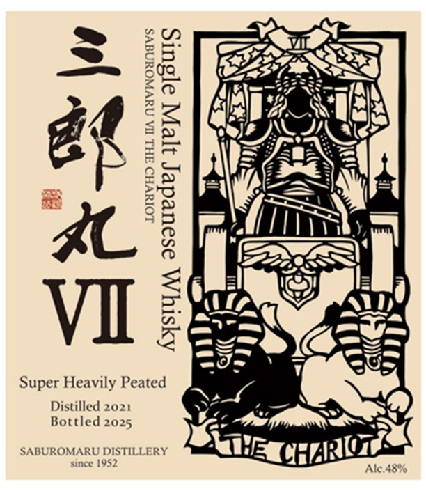

# TTB COLA Label Images - TTBID 26182001000072

**Brand Name:** SABUROMARU

**Fanciful Name:** VII THE CHARIOT

**Issue Date:** 07/08/2026

**Origin Code:** 59

**Product Class/Type:** 118

**Source:** [TTB Public COLA Registry](https://ttbonline.gov/colasonline/viewColaDetails.do?action=publicFormDisplay&ttbid=26182001000072)

## Label Images

### Back Label

### Front Label

## Extracted Label Text

*Text extracted via OCR - may contain errors*

**Detected Proof:** 96

### Back Label

SABUROMARU
VII THE CHARIOT
Kobayashi Sake
Selections
Single Malt Japanese Whisky _
700ML
48% ALC: BY VOL-
WWW
KobayashiSakeSelections.com
Saburomaru
Distillery, founded in 1952 in Toyama and guided today by
Master Blender Takahiko Inagaki, continues to push the boundaries of peated
Japanese whisky: In 2021, the distillery ventured into uncharted territory,
creating
a
super-heavily peated single malt at 80 ppm, the highest phenol level
in Saburomaru's history. Its intense smoke, reminiscent of dry earth and
scorched air, echoes like the rumble of wheels charging across rugged ground.
The Chariot is a bold harmony of richness, delicacy, strength and beauty:
Crafted for those who embrace the path of challenge and relentless forward
motion: 7,476 bottles produced.
Distilled 220/20021
Bottled 2025
BinYOWIN
SABUROMARU
KJ
DISTILLERY
JAPAN:
8
44650
09512
8
since 1952
PRODUCED & BOTTLE BY: SABUROMARU DISTILLERY
TOYAMA JAPAN
GOVERNMENT
WARNING: (1)
ACCORDING
TO
THE
SURGEON GENERAL,
WOMEN
SHOULD
NOT
DRINK
ALCOHOLIC
BEVERAGES
DURING
PREGNANCY BECAUSE OF THE RISK OF BIRTH DEFECTS.(2) CONSUMPTION
OF
ALCOHOLIC BEVERAGES IMPAIRS YOUR
ABILITY TO DRIVE
A_
CAR OR
OPERATE MACHINERY, AND MAY CAUSE HEALTH PROBLEMS.
IMPORTED BY PARK STREET IMPORTS LLC , MIAMI, FL
PRODUCT OF JAPAN
HI
NY
IA
MA
VT S4
CT ' OR
MI 104
ME 154
CA CRV
FRArRI
HRI
KOSHiR
J02

### Front Label

LOIIVHO FHL WA NYVWOUNAYS

Aysty\ osoueder yey asurs

Sxaw

Super Heavily Peated
Distilled 2021
Bottled 2025

SABUROMARU DISTILLERY
