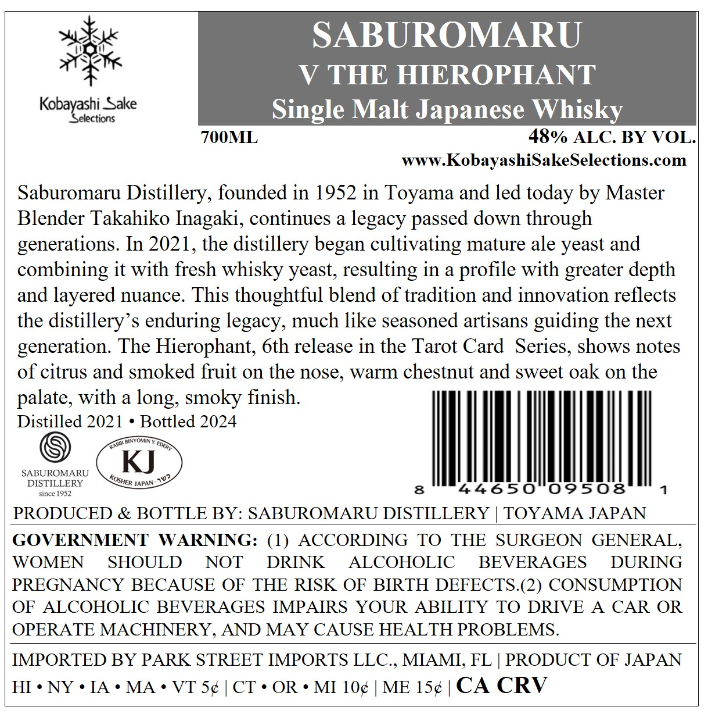
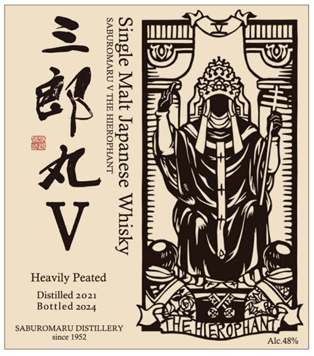

# TTB COLA Label Images - TTBID 26182001000106

**Brand Name:** SABUROMARU

**Fanciful Name:** V THE HIEROPHANT

**Issue Date:** 07/08/2026

**Origin Code:** 59

**Product Class/Type:** 118

**Source:** [TTB Public COLA Registry](https://ttbonline.gov/colasonline/viewColaDetails.do?action=publicFormDisplay&ttbid=26182001000106)

## Label Images

### Back Label

### Front Label

## Extracted Label Text

*Text extracted via OCR - may contain errors*

**Detected Proof:** 96

### Back Label

SABUROMARU
V THE HIEROPHANT
Kobayashi_
Selections
Sake
Single Malt Japanese Whisky
700ML
48% ALC. BY VOL
WWW
KobayashiSakeSelections com
Saburomaru Distillery, founded in 1952 in Toyama and led today by Master
Blender Takahiko Inagaki, continues a legacy passed down through
generations. In 2021, the distillery began cultivating mature ale yeast and
combining it with fresh whisky yeast, resulting in a profile with greater depth
and layered nuance. This thoughtful blend of tradition and innovation reflects
the distillery' s enduring legacy, much like seasoned artisans guiding the next
generation: The Hierophant; 6th release in the Tarot Card  Series, shows notes
of citrus and smoked fiuit on the nose, warm chestnut and sweet oak on the
palate, with a
smoky finish:
Distilled 2021
Bottled 2024
TuMin
KJ
SABUROMARU
DISTILLERY
JAPAN.2 %
since
952
8
44650
09508
PRODUCED & BOTTLE BY: SABUROMARU DISTILLERY
TOYAMA JAPAN
GOVERNMENT
WARNING: (1)
ACCORDING
TO
THE
SURGEON GENERAL
WOMEN
SHOULD
NOT
DRINK
ALCOHOLIC
BEVERAGES
DURING
PREGNANCY BECAUSE OF THE RISK OF BIRTH DEFECTS.(2) CONSUMPTION
OF
ALCOHOLIC BEVERAGES IMPAIRS YOUR
ABILITY TO DRIVE
A
CAR OR
OPERATE MACHINERY, AND MAY CAUSE HEALTH PROBLEMS.
IMPORTED BY PARK STREET IMPORTS LLC.
MIAMI, FL
PRODUCT OF JAPAN
HI ' NY
IA
MA
VT Sc
CT ' OR
MI 10c
ME 15c
CA CRV
long,
EDFT
ROSHER

### Front Label

<A \n

Heavily Peated

Distilled 2021
Bottled 2024

LNVHdOUSIH FHL A NUVWOUNEVS

AYstTy A osoueder Iepl a[suls
