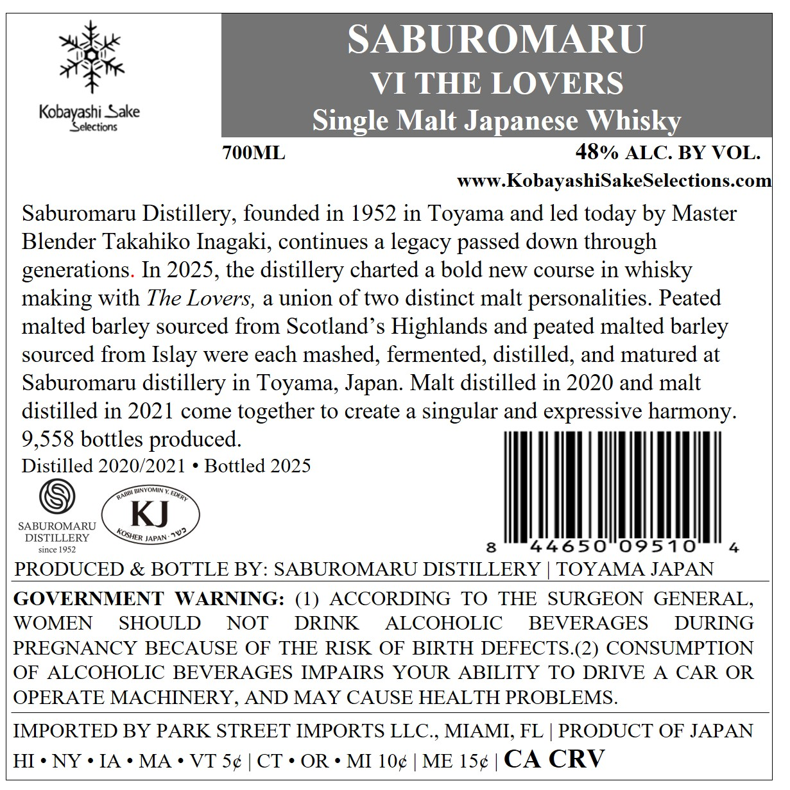
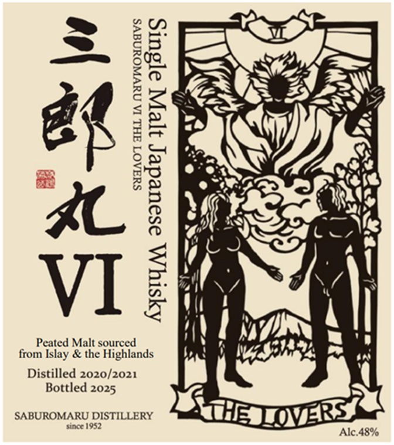

# TTB COLA Label Images - TTBID 26182001000128

**Brand Name:** SABUROMARU

**Fanciful Name:** VI THE LOVERS

**Issue Date:** 07/08/2026

**Origin Code:** 59

**Product Class/Type:** 118

**Source:** [TTB Public COLA Registry](https://ttbonline.gov/colasonline/viewColaDetails.do?action=publicFormDisplay&ttbid=26182001000128)

## Label Images

### Back Label

### Front Label

## Extracted Label Text

*Text extracted via OCR - may contain errors*

**Detected Proof:** 96

### Back Label

SABUROMARU
VI THE LOVERS
Kobayashiorsake
Single Malt Japanese Whisky
700ML
48% ALC: BY VOL.
www KobayashiSakeSelections com
Saburomaru Distillery, founded in 1952 in Toyama and led today by Master
Blender Takahiko Inagaki, continues a legacy passed down through
generations. In 2025, the distillery charted a bold new course in whisky
making with The Lovers, a union of two distinct malt personalities Peated
malted barley sourced from Scotland's Highlands and peated malted barley
sourced from
were each mashed, fermented, distilled, and matured at
Saburomaru distillery in Toyama, Japan. Malt distilled in 2020 and malt
distilled in 2021 come together to create a singular and expressive harmony.
9,558 bottles produced:.
Distilled 2020/2021
Bottled 2025
DikTHA
SABUROMARU
KJ
DISTILLERY
JAPAN
since 1952
8
44650
09510
PRODUCED & BOTTLE BY: SABUROMARU DISTILLERY
TOYAMA JAPAN
GOVERNMENT
WARNING: (1)
ACCORDING
TO
THE
SURGEON GENERAL
WOMEN
SHOULD
NOT
DRINK
ALCOHOLIC
BEVERAGES
DURING
PREGNANCY BECAUSE OF THE RISK OF BIRTH DEFECTS.(2) CONSUMPTION
OF
ALCOHOLIC BEVERAGES IMPAIRS YOUR
ABILITY TO DRIVE
A
CAR OR
OPERATE MACHINERY, AND MAY CAUSE HEALTH PROBLEMS.
IMPORTED BY PARK STREET IMPORTS LLC.
MIAMI, FL
PRODUCT OF JAPAN
HI . NY . IA
MA
VT Sc
CT ' OR
MI 1c
ME 150
CA CRV
Islay
RARRI
FDERT
KOSHER _

### Front Label

=
=
>

é

aC
VI

Peated Malt sourced
from Islay & the Highlands

SYAAOT AHL IA NUVWOUNAVS

AYsty A osoueder ie [sUIS

Distilled 2020/2021
Bottled 2025

since
