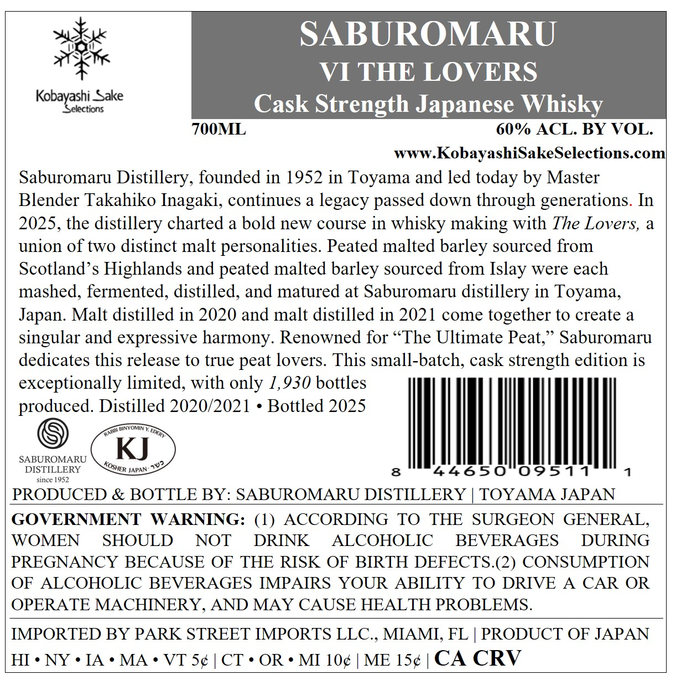
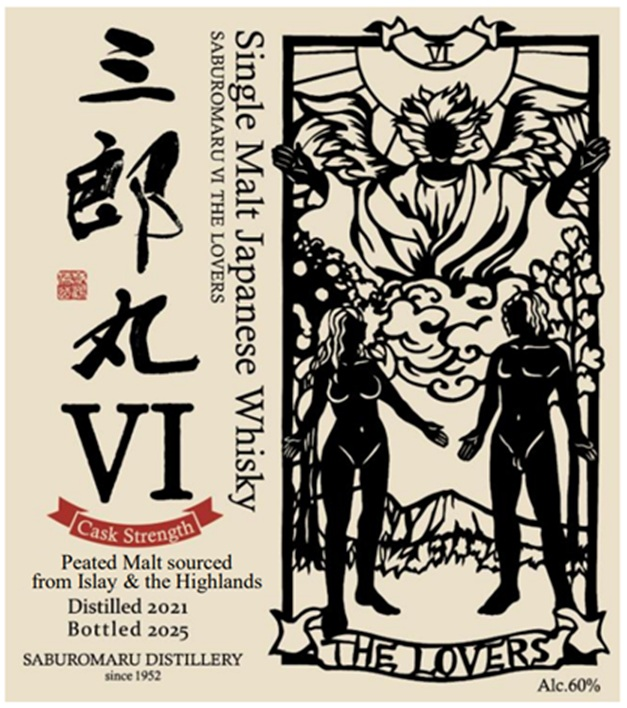

# TTB COLA Label Images - TTBID 26182001000141

**Brand Name:** SABUROMARU

**Fanciful Name:** VI THE LOVERS

**Issue Date:** 07/08/2026

**Origin Code:** 59

**Product Class/Type:** 118

**Source:** [TTB Public COLA Registry](https://ttbonline.gov/colasonline/viewColaDetails.do?action=publicFormDisplay&ttbid=26182001000141)

## Label Images

### Back Label

### Front Label

## Extracted Label Text

*Text extracted via OCR - may contain errors*

### Back Label

SABUROMARU
VI THE LOVERS
Kobayastiorsake
Cask Strength Japanese Whisky_
700ML
60% ACL BY VOL.
WWW_
.KobayashiSakeSelections com
Saburomaru Distillery, founded in 1952 in Toyama and led today by Master
Blender Takahiko Inagaki, continues a legacy passed down through generations. In
2025, the distillery charted a bold new course in whisky making with The Lovers, a
union of two distinct malt personalities Peated malted barley sourced from
Scotland 's Highlands and peated malted barley sourced from Islay were each
mashed, fermented, distilled, and matured at Saburomaru distillery in Toyama,
Japan. Malt distilled in 2020 and malt distilled in 2021 come together to create a
singular and expressive harmony. Renowned for " The Ultimate Peat;'
Saburomaru
dedicates this release to true peat lovers This small-batch; cask strength edition is
exceptionally limited, with only 1,930 bottles
produced. Distilled 2020/2021
Bottled 2025
RinyowIN
SABUROMARU
KJ
DISTILLERY
JAPAN
8
44650
0951 7
since 1952
PRODUCED & BOTTLE BY: SABUROMARU DISTILLERY
TOYAMA JAPAN
GOVERNMENT
WARNING: (1)
ACCORDING
TO
THE
SURGEON
GENERAL
WOMEN
SHOULD
NOT
DRINK
ALCOHOLIC
BEVERAGES
DURING
PREGNANCY BECAUSE OF THE RISK OF BIRTH DEFECTS.(2) CONSUMPTION
OF
ALCOHOLIC BEVERAGES IMPAIRS YOUR
ABILITY TO DRIVE
A
CAR OR
OPERATE MACHINERY, AND MAY CAUSE HEALTH PROBLEMS.
IMPORTED BY PARK STREET IMPORTS LLC , MIAMI, FL
PRODUCT OF JAPAN
HI . NY
IA
MA
VT Sc
CT
OR
MI 10c
ME 150
CA CRV
KARR
EDERT
Ju2
KOSHER

### Front Label

SYAAOT AHL IA NUVWOUNAVS

AYsty AA asoueder yep s[suls

(xs

__ Peated Malt sourced
from Islay & the Highlands
Distilled 2021
Bottled 2025
SABUROMARU DISTILLERY
since 1982
