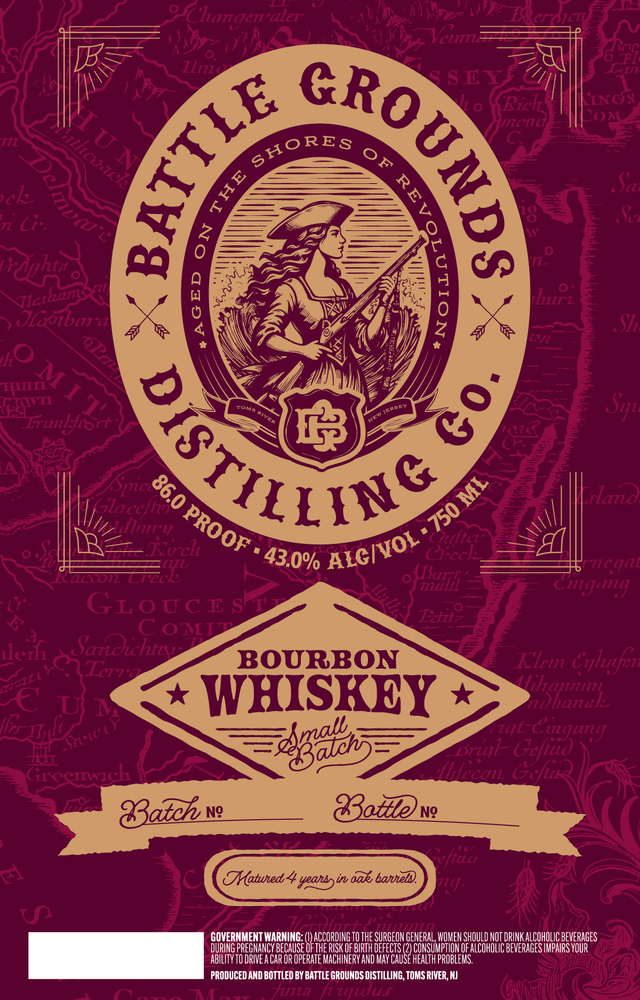

# TTB COLA Label Images - TTBID 26182001000150

**Brand Name:** BATTLE GROUNDS DISTILLING

**Issue Date:** 07/06/2026

**Origin Code:** 03

**Product Class/Type:** 141

**Source:** [TTB Public COLA Registry](https://ttbonline.gov/colasonline/viewColaDetails.do?action=publicFormDisplay&ttbid=26182001000150)

## Label Images

### Label 1

## Extracted Label Text

*Text extracted via OCR - may contain errors*

**Detected Proof:** 86

### Label 1

3
aiet
Ilzzz
S EY
Ricl
LNG<
OA
Pl14
al
72 G":
djhi
Jlobox
9
lirL
hO
FTL
7241
Irulgiort
Spice
aid
Gla ccfi
"i1r'l
Getftcz
Eorch
Creck
'k944
FEL
(TiIl
17710 lj4L
Citjur
GLOGcE srr
Iettz
CoMT
llez
Saroichizu
BOURBON
Kli
Crluzfen
TTz
WHISKEY
Hiharrtnt
77
hanak
743ab3
Geftud
Grcemch
fhecon_Gcfus
8atch
Ng
Gttevg_
FLCu
A
Tatuned
yeansyin aak banneld.
714].
U
Hadonen
GOVERNMENT WARNING
ACCORDING TO THE SURGEON GENERAL; WOMEN SHOULD NOT DRINK ALCOHOLIC BEVERAGES
DURING PREGNANCY BECAUSE Of THE RISK OF BIRTH DEfects (2) CONSUMPTHON OF ALCOhOLIC BEVERAGES IMPAIRS VOUR
ABILITY TO DRIVE A CaR OR OpeRate MAChINeRV AND May CAuse health probleMs.
PRODUCED AND BOTTLED BY BATTLE GROUNDS DISTILLING, TOMS RIVER; NJ
Tuiu
Hutwuf
NE
Clugen
)
1
5
MLcack
SHORES
oF
1
0
8
1
Jlctzam
QuM T 1'
RGTILSSY
8
Sq"
eRaE;
Tona
RVER
8
4
'750
PROOF
ALCIVOL
43.0%
Tj 13
Cuujurj
Zut (
Suall" €
Brzql_
