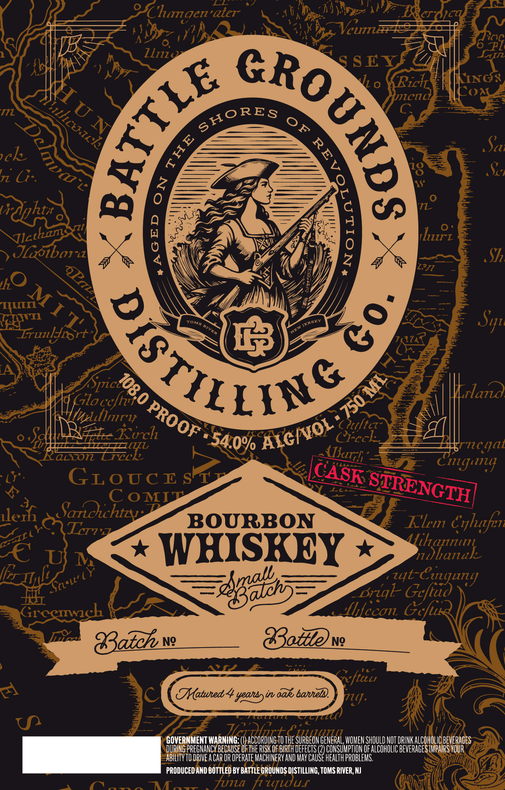

# TTB COLA Label Images - TTBID 26182001000154

**Brand Name:** BATTLE GROUNDS DISTILLING

**Issue Date:** 07/06/2026

**Origin Code:** 03

**Product Class/Type:** 141

**Source:** [TTB Public COLA Registry](https://ttbonline.gov/colasonline/viewColaDetails.do?action=publicFormDisplay&ttbid=26182001000154)

## Label Images

### Label 1

## Extracted Label Text

*Text extracted via OCR - may contain errors*

### Label 1

IChmgen'aier
Vcum
Llilz.
S
0
Ricl
Kixcs
zcnc
Con
nL
4
Sz
ch
0
n2 G:
Vrdghti
Jlbbort
8
hur_
S7
HI
#ta
Irmlyirt
A
Giloc
Toridoo
0
aid
Mlul
Ouftcz
Af_Kich
Crcck_
accon
Zz
TT7cqal
F
Cingun
GLoGcE sr
C oMIT
8
llez
Sarichtzy
BOURBON
Klm
Crlufen
YCR?Tzzz
'€ Uv
WHISKEY
YihSlanak
F~igads
Briqk- Geftud
Grcemnch
hfccon Gcfu
83atch
Ng
Gttevg_
"ftuu
2
THatuned
yeansyin aak banneld.
71]=
U
GOVERNMENT WARNING
HHEQUHHG TESREDHEAEHA
WOMEN SHOULD NOT DRINK ALCOHOLIC BEVERAGES
DURING PREGNANCY BECAUSE fThE RISK OF BIRTH defects
CONSUMPTION OF ALCOhOLIC BEvERAGES IMPAIRS VOUR
ABILITY TO DRIVE A CaR OR Operate MaChIneRV AND May Cause health prOblems.
PRODUCED AND BOTTLED BY BATTLE GROUNDS DISTILLING, TOMS RIVER; NJ
Tn
TT
funa
hujwus
)
1
HuN
illcuacke
SHORES
oF
1
8
1
Jlcthams
QPa
IO
huM I 1'
ROTILSY
8
Sq"
JeraE
Tona
0
1
PROOF
Iinr 4
% AIGIvOL _
'54.0%
llurh
CASK
STRENGTH
CIL(
Cuujunj
zyt (
~Sneut'
