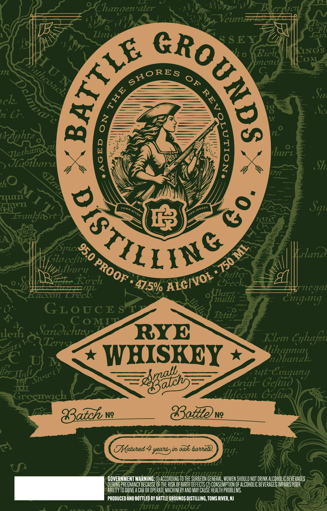

# TTB COLA Label Images - TTBID 26182001000158

**Brand Name:** BATTLE GROUNDS DISTILLING

**Issue Date:** 07/06/2026

**Origin Code:** 03

**Product Class/Type:** 142

**Source:** [TTB Public COLA Registry](https://ttbonline.gov/colasonline/viewColaDetails.do?action=publicFormDisplay&ttbid=26182001000158)

## Label Images

### Label 1

## Extracted Label Text

*Text extracted via OCR - may contain errors*

**Detected Proof:** 95

### Label 1

Chumgenaier
llizz
S
Ricl
CINCR
ClLi
COA
FL
4
Sc;
ch
0
n G::
ViUphta
Jloibon
F1z
8
hurz
S7
'Hn
Irulyiort
aic
GGlocefi
Vli
Puftcz
Kirch
Crecl:_
ion
Zrec
Hiuh
77c qjL
Cigun
GLocE sr
C oMTT
llezf
Saroichtzv
RYE
Elm
Crlurfere
RTz
WHISKEY
Nianak
77
~lgab
Briqk- Geftud
Grcemnch
Ibfccon Gcfux
83atch
Ng
Gttene_
ftuu
0
Tatued
yeans)in bak, batieln
714].
U
GOVERNMENT WARNING
ACCORDING
THE
HESURREDV GEVERAL VOHEHSHOHLDHDTORHKALCUHDUE DEVERHGES
DURING PREGNANCY BECAUSE OfTHE RISK OF BIRTH DEfECTS
CONSUMPTHON OF ALCOHOLIC BEVERAGES IMPAIRS YOUR
ABILITY TO DRIVE A CaR OR OpeRate MACHINERV AND MaY CAuSe HealTh problems;
PRODUCED AND BOTTLED BY BATTLE GROUNDS DISTILLING, TOMS RIVER; NJ
funa hufwuf
)
1
uN
'llcacke
SHORES
0F
0
1
8
Jlctham
tn
IKO
huM I 1'
RSTILSS
8
Sy"
JEREE
Tona
RIVER
4
(Spic 950
ML
'750
PROOF
Iinr"4
ALCIVOL
47.5%
Eitz
329
~
Cuujun]
z4t .
SneLt'
PCOROIG TOT
