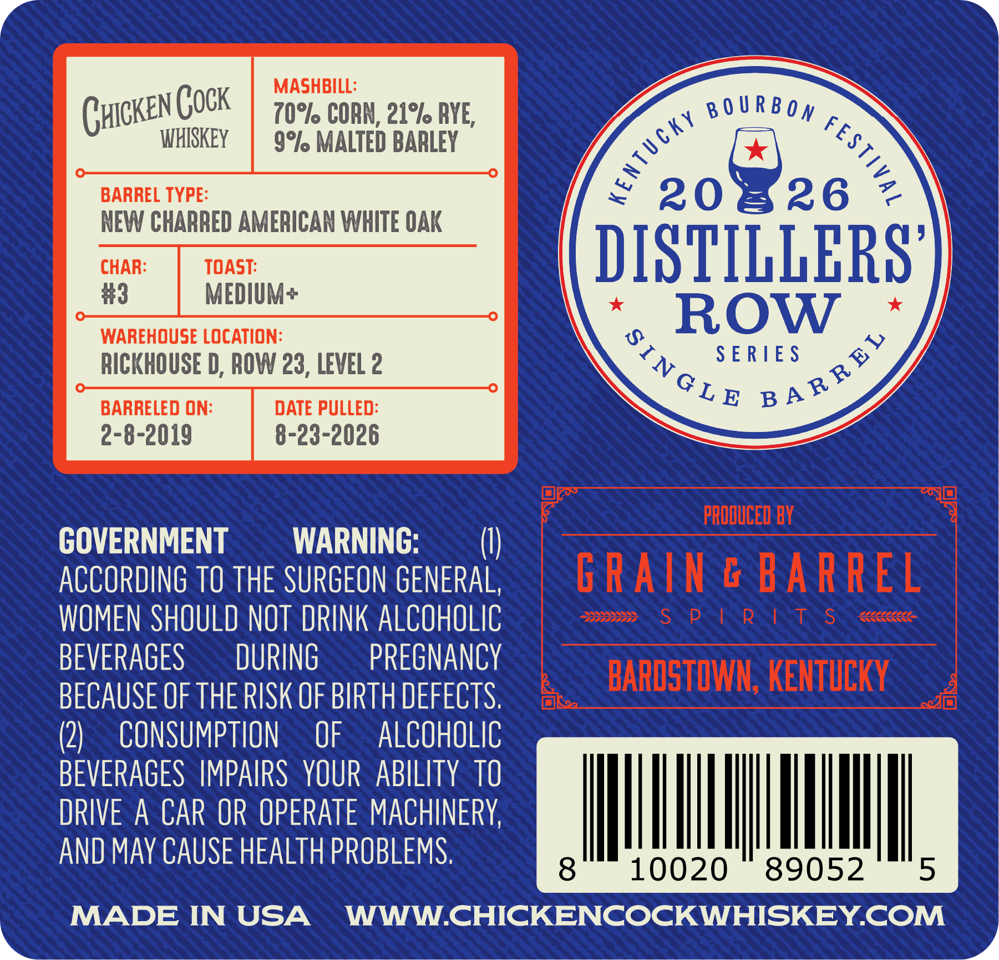
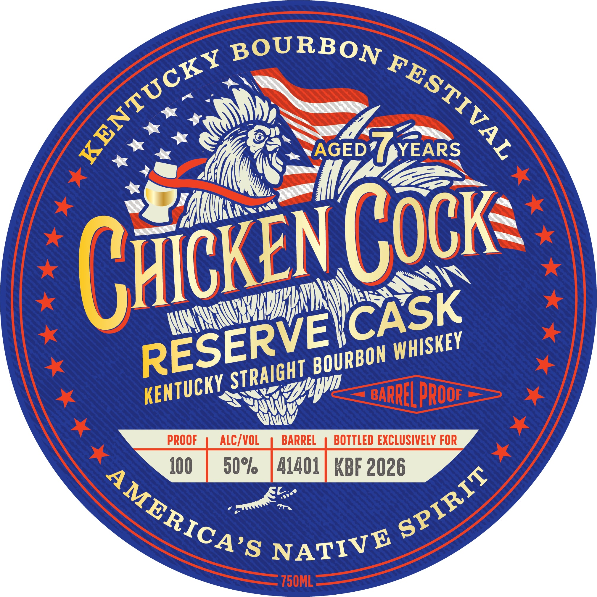

# TTB COLA Label Images - TTBID 26182001000174

**Brand Name:** CHICKEN COCK

**Issue Date:** 07/06/2026

**Origin Code:** 22

**Product Class/Type:** 101

**Source:** [TTB Public COLA Registry](https://ttbonline.gov/colasonline/viewColaDetails.do?action=publicFormDisplay&ttbid=26182001000174)

## Label Images

### Back Label

### Front Label

## Extracted Label Text

*Text extracted via OCR - may contain errors*

**Detected Proof:** 100

### Back Label

MASHB

70°/o CORN, 21°/ AYE

(

yIcKEN GOK

WHISKEY

9°/o MALTED BARLEY

os BOURBOY “sy.

BARREL TYPE

S20

2

NEW CHARRED AMERICAN WHITE OAK

CHAR

TOAST

DISTILL

ERS

#3

MEDIUM+

*

WAREHOUSE LOCATION

Le

ROW

a

RICKHOUSE D, ROW 23, LEVEL 2

SERIES

BARRELED ON

DATE PULLED

CLE pa®

2-8-2019

8-23-2026

GOVERNMENT

WARNING

)

ACCORDING TO THE SURGEON GENERAL

WOMEN SHOULD NOT DRINK ALCOHOLIC

BEVERAGES

DURING

PREGNANCY

BECAUSE OF THE RISK OF BIRTH DEFECTS

(2)

CONSUMPTION OF ALCOHOLIC

BEVERAGES IMPAIRS YOUR ABILITY TO

DRIVE A CAR OR OPERATE MACHINERY

Hl

|

Il

AND MAY CAUSE HEALTH PROBLEMS

il

10020

89052

I.

MADE IN USA WWW.CHICKENCOCKWHISKEY.COM

&

4

### Front Label

BOURBON
AGED
YEARS
L
BARREL PROoF
PROOF
ALC/ VOL
BARREL
BOTTLED EXCLUSIVELY FOR
J00
50%
41401
KBF 2026
750ML
KENTUCKY
FESTIVAL
Chcken Cock
CASK
RESERVEI
WHISKEY
BOURBON
STRAIGHT
KENTUCKY
Hyvn
SPIRIT
AMERICA'S
NATIVE
