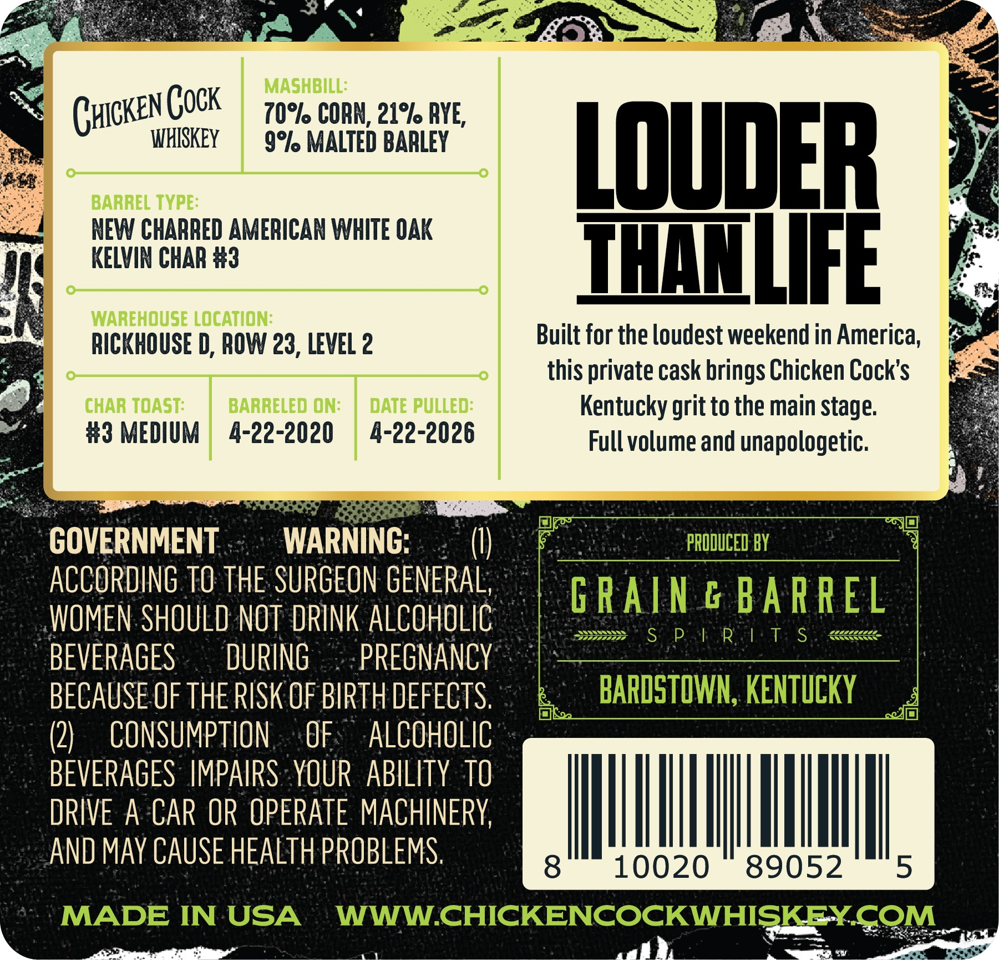
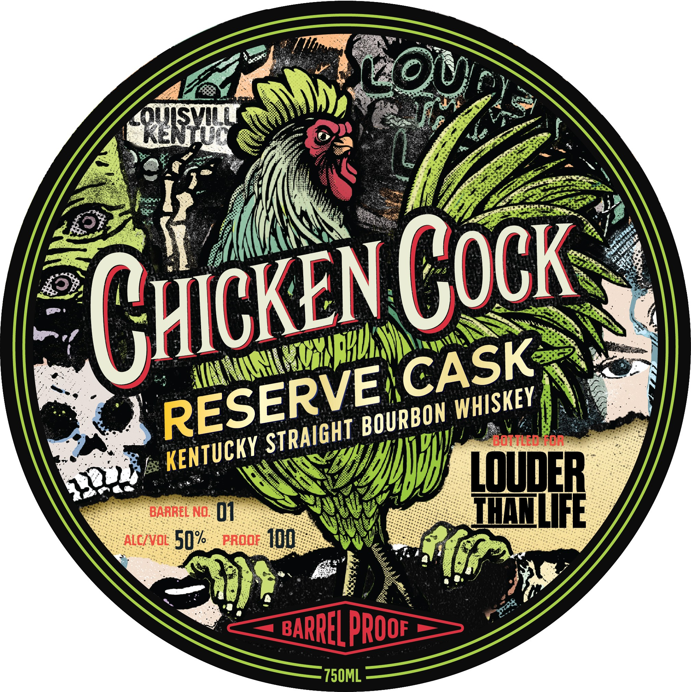

# TTB COLA Label Images - TTBID 26182001000180

**Brand Name:** CHICKEN COCK

**Issue Date:** 07/07/2026

**Origin Code:** 22

**Product Class/Type:** 101

**Source:** [TTB Public COLA Registry](https://ttbonline.gov/colasonline/viewColaDetails.do?action=publicFormDisplay&ttbid=26182001000180)

## Label Images

### Back Label

### Front Label

## Extracted Label Text

*Text extracted via OCR - may contain errors*

**Detected Proof:** 100

### Back Label

a * a

cK

atin’

MASHBI

Bs Cui

KEN COCK

WHISKEY

9°% MALTED BARLEY

10°lo CORK, 21° RYE,

BARREL TYPE

LOUDER

NEW CHARRED AMERICAN WHITE OAK

KELVIN CHAR #

THANLIFE r

WAREHOUSE LOCATION

Built for the loudest weekend in America,

RICKHOUSE D, ROW 23, LEVEL 2

this private cask brings Chicken Cock’s

oO:

CHAR TOAST

#3 MEDIUM | 4-22-2020

BARRELED ON

4-22-2026

DATE PULLED

Kentucky grit to the main stage

Full volume and unapologetic

acl

_ oe

[ay

GOVERNMENT

WARNING:

(I

ACCORDING 10 THE SURGEON GENERAL

=

WOMEN SHOULD NOT DRINK ALCOHOLIC

SSS

BEVERAGES

DURING ©

-PREGNANCY

bel

BECAUSE OF THE RISK OF BIRTH DEFECTS,

(2

CONSUMPTION..OF: ALCOHOLIC

BEVERAGES IMPAIRSYOUR ABILITY TO

DRIVE A CAR OR OPERATE MACHINERY

AN

AND MAY CAUSE HEALTH PROBLEMS

ad I |

peeing ana

Fy

—

— <4

### Front Label

0)
Svu
Botted-or
VU poudeR
BARREL NO:
01
TMNLIFE
ALcIvoL
50%
PROOF
100
BARREL PrOOF
750ML
GHIcKEN Cock
CASK
RESERVE
WHISKEY
BOURBON
STRAIGHT
KENTUCKY
