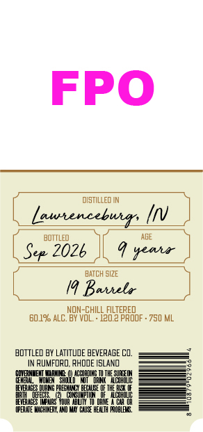
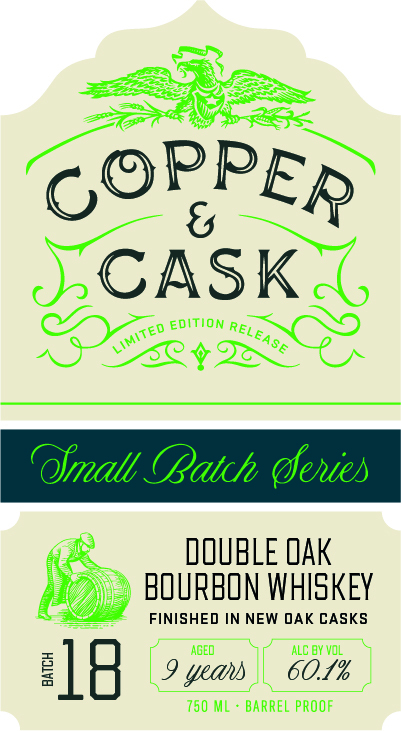

# TTB COLA Label Images - TTBID 26182001000197

**Brand Name:** COPPER & CASK

**Issue Date:** 07/06/2026

**Origin Code:** 40

**Product Class/Type:** 141

**Source:** [TTB Public COLA Registry](https://ttbonline.gov/colasonline/viewColaDetails.do?action=publicFormDisplay&ttbid=26182001000197)

## Label Images

### Back Label

### Front Label

### Label 3

## Extracted Label Text

*Text extracted via OCR - may contain errors*

**Detected Proof:** 120.2

### Back Label

FPO
distILLEd IN
laurenceburr,
bottled
AGE
Sep 2026
yeait
BATCH SIZE
Bautela
NON-ChILL FILTERED
60.19 ALC. BY VOL;
120.2 pROOF . 750 ML
BOTTLED BY LATITUDE BEVERAGE CI:
RuMfoRO. RhodE ISLAND
EEVE
JROHDMBHJHEIUHMM
EETEEE
E3B
(PEAATE WUCHIMEAY
QIUSE HEVLTH FAOBLES .

### Front Label

COPPER
6
CASK
ediTION
8y
60 _
OImall (Batch (eies
DOUBLE QAK
BOURBON WHISKEY
FINISHED IN NEW DAK CASKS
AGED
ALC DY Vol
3
18
yeahs
60.1%
750 ML
BARREL PROOF
RELEASE
Limited =

### Label 3

COPPER & CASK Say

MSW 8 WdddOd

a=
