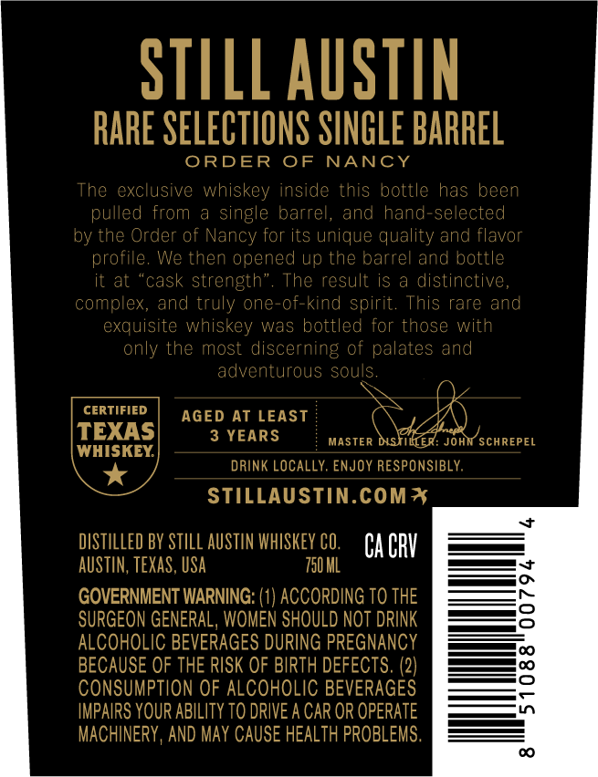
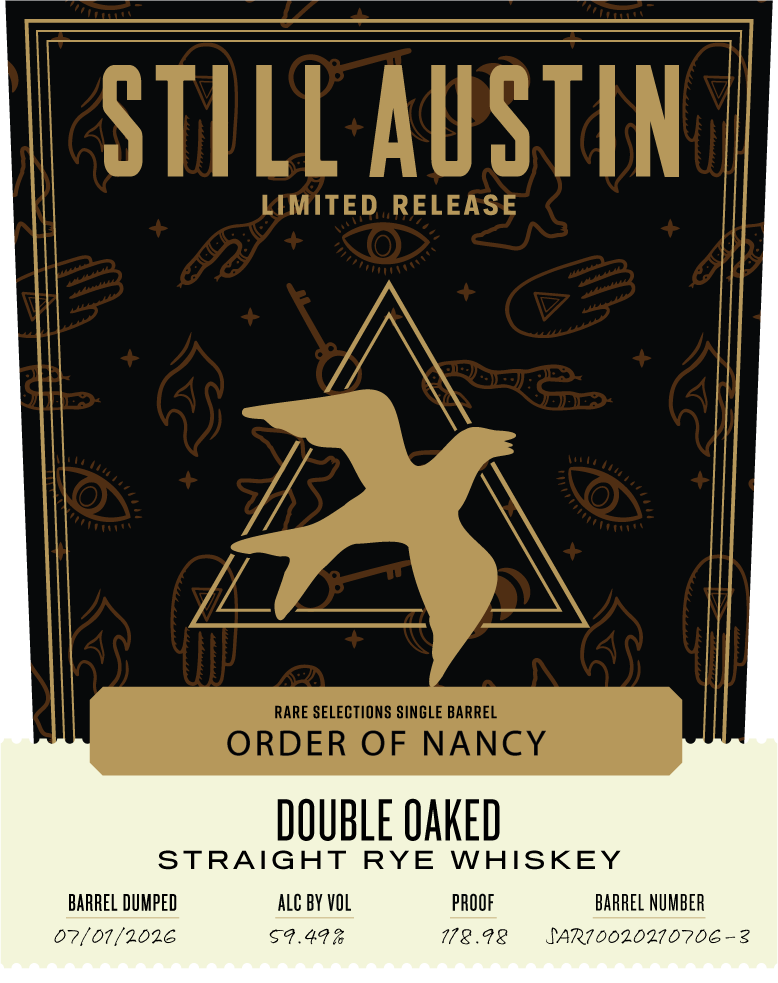

# TTB COLA Label Images - TTBID 26182001000203

**Brand Name:** STILL AUSTIN

**Fanciful Name:** ORDER OF NANCY

**Issue Date:** 07/06/2026

**Origin Code:** 44

**Product Class/Type:** 142

**Source:** [TTB Public COLA Registry](https://ttbonline.gov/colasonline/viewColaDetails.do?action=publicFormDisplay&ttbid=26182001000203)

## Label Images

### Back Label

### Front Label

### Label 3

## Extracted Label Text

*Text extracted via OCR - may contain errors*

**Detected Proof:** 119
**Detected Age:** 3 Years

### Back Label

STILL AUSTIN
RARE SELECTIONS SINGLE BARREL
ORDER
OF
NANCY
The exclusive whiskey inside this bottlc
has been
pulled
single barrel, and hand-selected
by the Order of Nancy for its unique quality and flavor
profile.
We then opened up the barrel and bottle
it at
cask strength"
result is
a distinctive,
complex,
and truly one-of-kind spirit. This rare and
exquisite whiskey was bottled for those with
only the most discerning of palates and
adventurous souls
CERTIFIED
AGED AT LEAST
TEXAS
3 YEARS
MASTER DISTILER: John SCHREPEL
WHISKEY
DRINK LOCALLY; ENJOY RESPONSIBLY
STILLAUSTIN.COM*
DISTILLED BY STILL AUSTIN WHISKEY CO.
Ca CRV
AUSTIN, teXAS, USA
750 HL
GOVERNMENT WARNING: (1) ACCORDING TO THE
SURGEON GENERAL, WOMEN SHOULD NOT DRINK
ALCOHOLIC BEVERAGES DURING PREGNANCY
BECAUSE OF THE RISK OF BIRTH DEFECTS. (2)
ConsumptiON OF ALCOHOLIC BEVERAGES
2
IMPAIRS YOUR ABILITY TO DRIVE A CAR OR OPERATE
MACHINERY , AND May CAUSE HEALTH PROBLEMS.
from
The

### Front Label

STILL AUSTIN
LIMITED RELEASE
RARE SELECTIONS SINGLE BARREL
ORDER OF
NANCY
DOUBLE OAKED
STRAIGHT
RYE
WAISKEY
BARREL DUMPED
alc BY VOL
PROOF
BARREL NUMBER
07/01/2026
59.49%
178.98
JAR70020270706-2

### Label 3

SINGLE BARREL CASK STRENGTH | > HLONAYLS WSVO 17NUVE JTINIS

a
